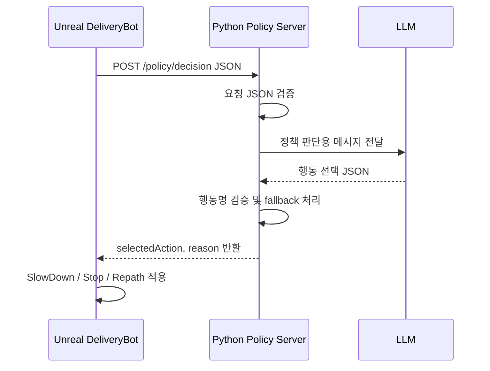

# AI Agent Policy Server JSON Guide

이 문서는 `DeliveryBot`의 정책판단 기능을 Python 서버와 연결하고, Python 서버가 LLM을 사용해 주행 행동을 판단하도록 만들기 위한 입출력 약속이다.

현재 Unreal C++ 코드는 `UDeliveryBot_PolicyJudgmentComponent`에서 Python 서버로 HTTP `POST` 요청을 보내고, Python 서버 응답의 `selectedAction`과 `reason`을 읽어 `DeliveryBot` 행동으로 바꾼다.

## 전체 흐름



## Unreal에서 Python으로 보내는 형식

요청 URL 기본값은 다음과 같다.

| 항목 | 값 |
| --- | --- |
| HTTP method | `POST` |
| URL | `http://127.0.0.1:8000/policy/decision` |
| Content-Type | `application/json` |
| Timeout | `1.0` second |
| 최소 요청 간격 | `0.5` second |

현재 C++이 실제로 보내는 JSON은 아래 형식이다.

```json
{
  "schemaVersion": "1.0.0",
  "requestId": "0f5fd5f7-a904-4a6f-a2b8-15b82f52de44",
  "policyContext": {
    "hasFrontObject": true,
    "frontObjectDistanceM": 0.85,
    "stopDistanceM": 1.2,
    "slowDownDistanceM": 3.5,
    "currentSpeedKmh": 4.8,
    "maxSpeedKmh": 10.0,
    "canRepath": true,
    "inRepathMoveGraceTime": false
  }
}
```

## 요청 필드 설명

| 필드 | 자료형 | 단위 | 설명 |
| --- | --- | --- | --- |
| `schemaVersion` | string | 없음 | 통신 포맷 버전. 현재는 `1.0.0`. |
| `requestId` | string | 없음 | 요청마다 새로 생성되는 ID. 로그 추적용. |
| `policyContext` | object | 없음 | LLM이 판단할 때 필요한 상황 정보. |

### policyContext

| 필드 | 자료형 | 단위 | 설명 |
| --- | --- | --- | --- |
| `hasFrontObject` | boolean | 없음 | 전방에 감지된 물체가 있는지. 현재 C++은 `false`이면 서버 요청을 보내지 않고 `None`으로 처리한다. |
| `frontObjectDistanceM` | number | meter | 가장 가까운 전방 물체까지의 거리. |
| `stopDistanceM` | number | meter | 이 거리 이하이면 정지 또는 재탐색이 필요한 위험 거리. |
| `slowDownDistanceM` | number | meter | 이 거리 이하이면 감속 판단을 시작하는 거리. |
| `currentSpeedKmh` | number | km/h | 현재 DeliveryBot 속도. |
| `maxSpeedKmh` | number | km/h | 설정상 최대 속도. |
| `canRepath` | boolean | 없음 | 현재 재탐색을 시도해도 되는지. |
| `inRepathMoveGraceTime` | boolean | 없음 | 방금 재탐색에 성공해서 잠깐 더 움직이도록 허용한 시간 안인지. |

## Python에서 받아야 하는 모델

Python 서버에서는 먼저 요청 JSON을 안정적으로 검증해야 한다. 초보자 기준으로는 `FastAPI`와 `pydantic`을 쓰는 것이 가장 쉽다.

```python
from pydantic import BaseModel


class PolicyContext(BaseModel):
    hasFrontObject: bool
    frontObjectDistanceM: float
    stopDistanceM: float
    slowDownDistanceM: float
    currentSpeedKmh: float
    maxSpeedKmh: float
    canRepath: bool
    inRepathMoveGraceTime: bool


class PolicyRequest(BaseModel):
    schemaVersion: str
    requestId: str
    policyContext: PolicyContext
```

## Python에서 Unreal로 반환해야 하는 형식

현재 C++은 응답 JSON에서 아래 두 필드만 읽는다.

```json
{
  "selectedAction": "Repath",
  "reason": "전방 물체가 stopDistanceM 안에 있고 canRepath가 true라서 경로 재탐색을 선택함"
}
```

| 필드 | 자료형 | 필수 | 설명 |
| --- | --- | --- | --- |
| `selectedAction` | string | 필수 | Unreal에서 적용할 행동 이름. |
| `reason` | string | 선택 | 판단 이유. 로그 확인용. |

`selectedAction`은 아래 값 중 하나를 반환해야 한다.

| selectedAction | 현재 C++ 적용 결과 | 권장 사용 여부 |
| --- | --- | --- |
| `None` | 현재 경로 추종 명령을 그대로 유지 | 사용 가능 |
| `SlowDown` | 전방 장애물 거리 기준으로 감속 | 사용 가능 |
| `Stop` | 목표속도 0, 브레이크 적용 | 사용 가능 |
| `Repath` | 전방 장애물을 동적 차단 셀로 등록하고 A* 재탐색 시도 | 사용 가능 |
| `Avoidance` | 문자열 파싱은 되지만 현재 Actor 쪽 적용 로직 없음 | 현재는 반환하지 않는 것을 권장 |
| `RequestControl` | 문자열 파싱은 되지만 현재 Actor 쪽 적용 로직 없음 | 현재는 반환하지 않는 것을 권장 |

주의: `EDeliveryBotPolicyActionType`에는 `End`가 있지만 현재 문자열 파서에서 처리하지 않는다. Python 서버는 `End`를 반환하지 않아야 한다.

## Python 서버 기본 양식

아래 코드는 최소 동작 예시다. LLM 호출이 실패해도 Unreal에는 항상 올바른 JSON을 반환하는 쪽이 안전하다.

```python
from fastapi import FastAPI
from pydantic import BaseModel

app = FastAPI()

ALLOWED_ACTIONS = {"None", "SlowDown", "Stop", "Repath"}


class PolicyContext(BaseModel):
    hasFrontObject: bool
    frontObjectDistanceM: float
    stopDistanceM: float
    slowDownDistanceM: float
    currentSpeedKmh: float
    maxSpeedKmh: float
    canRepath: bool
    inRepathMoveGraceTime: bool


class PolicyRequest(BaseModel):
    schemaVersion: str
    requestId: str
    policyContext: PolicyContext


class PolicyResponse(BaseModel):
    selectedAction: str
    reason: str


def fallback_decision(context: PolicyContext) -> PolicyResponse:
    if not context.hasFrontObject:
        return PolicyResponse(selectedAction="None", reason="전방 물체가 없음")

    if context.inRepathMoveGraceTime:
        return PolicyResponse(selectedAction="SlowDown", reason="재탐색 직후 grace time 중이라 감속")

    if context.frontObjectDistanceM <= context.stopDistanceM:
        if context.canRepath:
            return PolicyResponse(selectedAction="Repath", reason="정지 거리 안의 전방 물체 때문에 재탐색")
        return PolicyResponse(selectedAction="Stop", reason="정지 거리 안의 전방 물체가 있고 재탐색 불가")

    if context.frontObjectDistanceM <= context.slowDownDistanceM:
        return PolicyResponse(selectedAction="SlowDown", reason="감속 거리 안에 전방 물체가 있음")

    return PolicyResponse(selectedAction="None", reason="위험 거리 밖")


def ask_llm_for_decision(request: PolicyRequest) -> PolicyResponse:
    # 여기에 LLM 호출 코드를 넣는다.
    # 중요한 점은 LLM 결과를 그대로 믿지 말고 selectedAction을 반드시 검증하는 것이다.
    #
    # 예시 반환값:
    # return PolicyResponse(selectedAction="Repath", reason="LLM 판단 이유")
    return fallback_decision(request.policyContext)


@app.post("/policy/decision", response_model=PolicyResponse)
def decide_policy(request: PolicyRequest):
    try:
        decision = ask_llm_for_decision(request)
    except Exception as error:
        fallback = fallback_decision(request.policyContext)
        fallback.reason = f"LLM failure fallback: {fallback.reason}"
        return fallback

    if decision.selectedAction not in ALLOWED_ACTIONS:
        fallback = fallback_decision(request.policyContext)
        fallback.reason = f"Invalid LLM action fallback: {fallback.reason}"
        return fallback

    return decision
```

서버 실행 예시:

```bash
uvicorn policy_server:app --host 127.0.0.1 --port 8000
```

## LLM에 넘길 프롬프트 양식

LLM에는 자연어로만 요청하지 말고, 반드시 선택 가능한 행동과 출력 JSON 형식을 고정해서 전달해야 한다.

```text
You are a policy decision agent for a DeliveryBot simulation.

Choose exactly one action from:
- None
- SlowDown
- Stop
- Repath

Rules:
- If hasFrontObject is false, choose None.
- If inRepathMoveGraceTime is true, prefer SlowDown.
- If frontObjectDistanceM <= stopDistanceM and canRepath is true, prefer Repath.
- If frontObjectDistanceM <= stopDistanceM and canRepath is false, choose Stop.
- If frontObjectDistanceM <= slowDownDistanceM, choose SlowDown.
- Otherwise choose None.

Return only JSON.
No markdown.
No extra explanation.

Input:
{policy_context_json}

Output format:
{
  "selectedAction": "SlowDown | Stop | Repath | None",
  "reason": "short reason"
}
```

## LLM 응답 검증 규칙

Python 서버는 LLM 응답을 받은 뒤 아래 순서로 확인해야 한다.

1. JSON으로 파싱 가능한가?
2. `selectedAction`이 있는가?
3. `selectedAction`이 허용 목록 안에 있는가?
4. `reason`이 없으면 빈 문자열이나 기본 사유로 채울 수 있는가?
5. 이상하면 fallback 판단을 반환하는가?

Unreal 쪽 HTTP timeout 기본값이 `1.0`초라서 LLM 응답이 느리면 실패할 수 있다. LLM을 직접 호출할 때는 둘 중 하나를 선택하는 것이 좋다.

| 방식 | 설명 |
| --- | --- |
| timeout 늘리기 | Unreal의 `RequestTimeoutSecond`를 3초 이상으로 늘린다. 구현은 쉽지만 시뮬레이션 반응이 늦을 수 있다. |
| 빠른 fallback 반환 | LLM이 늦거나 실패하면 Python에서 즉시 rule fallback을 반환한다. 실시간성에 더 안전하다. |

## 테스트용 curl

Python 서버가 Unreal 없이도 동작하는지 먼저 확인할 수 있다.

```bash
curl -X POST http://127.0.0.1:8000/policy/decision \
  -H "Content-Type: application/json" \
  -d '{
    "schemaVersion": "1.0.0",
    "requestId": "manual-test-001",
    "policyContext": {
      "hasFrontObject": true,
      "frontObjectDistanceM": 0.8,
      "stopDistanceM": 1.2,
      "slowDownDistanceM": 3.5,
      "currentSpeedKmh": 5.0,
      "maxSpeedKmh": 10.0,
      "canRepath": true,
      "inRepathMoveGraceTime": false
    }
  }'
```

예상 응답:

```json
{
  "selectedAction": "Repath",
  "reason": "정지 거리 안의 전방 물체 때문에 재탐색"
}
```

## 현재 C++ 적용 방식 요약

| Python 반환값 | Unreal 처리 |
| --- | --- |
| `None` | `PathFollowComponent`가 만든 기존 이동 명령을 그대로 사용 |
| `SlowDown` | `ApplyFrontObstacleSlowDown()`으로 전방 거리 기반 감속 |
| `Stop` | `ApplyStopCommand()`로 정지 |
| `Repath` | `TryRequestRepathByFrontObject()` 실행. 성공하면 새 경로를 따라 감속 이동, 실패하면 정지 |

현재 C++은 비동기 HTTP 방식이다. 서버 응답이 아직 오지 않은 프레임에서는 `BuildWaitingRemoteDecision()`으로 임시 행동을 적용한다.

| 상황 | 응답 대기 중 임시 행동 |
| --- | --- |
| 전방 물체 없음 | `None` |
| 전방 물체가 `stopDistanceM` 이하 | `Stop` |
| 그 외 전방 물체 있음 | `SlowDown` |

## 확장할 때 권장하는 추가 필드

현재 C++은 아래 필드를 보내지 않는다. LLM 판단을 더 정교하게 만들고 싶을 때 추가하면 좋다.

| 추가 필드 | 자료형 | 단위 | 쓰임 |
| --- | --- | --- | --- |
| `actorName` | string | 없음 | 어떤 액터를 보고 판단했는지 로그용. |
| `actorTags` | string array | 없음 | 보행자, 정적 장애물 등 대상 종류 판단. |
| `goalDistanceM` | number | meter | 목적지에 가까울 때 무리한 재탐색을 줄이기. |
| `pathRemainingDistanceM` | number | meter | 남은 경로 길이 기준 판단. |
| `lastAction` | string | 없음 | 같은 행동이 너무 자주 반복되는 것 방지. |
| `repathCooldownRemainingS` | number | second | 재탐색 쿨다운 중이면 Stop/SlowDown 우선. |

이 필드를 추가하려면 C++의 `FDeliveryBotPolicyContextInfo`, `BuildPolicyContextInfo()`, `BuildRemotePolicyRequestJson()`도 함께 수정해야 한다.

## 구현 체크리스트

1. Python 서버가 `POST /policy/decision`을 열고 있는지 확인한다.
2. Unreal의 `PolicyServerUrl`이 Python 서버 주소와 같은지 확인한다.
3. Python 요청 모델에 `policyContext` 필드가 있는지 확인한다.
4. Python 응답에 `selectedAction`이 반드시 있는지 확인한다.
5. `selectedAction`은 `None`, `SlowDown`, `Stop`, `Repath` 중 하나로 제한한다.
6. LLM 실패 시에도 fallback 판단을 반환한다.
7. `curl`로 먼저 테스트한 뒤 Unreal PIE에서 테스트한다.
