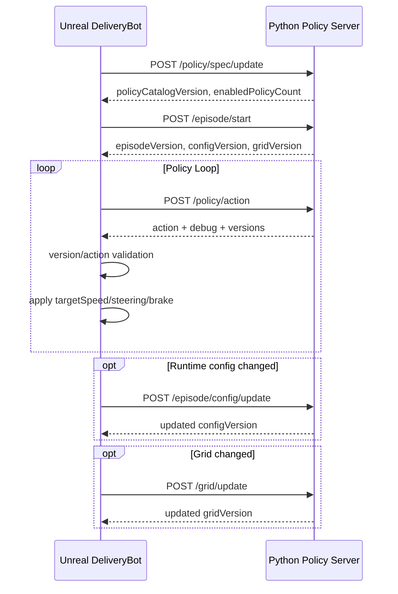

# DeliveryBot Python API Current

이 문서는 현재 `ADeliveryBot`과 `Tools/PythonPolicyServer` 사이에서 사용하는 HTTP API 계약을 정리한다.

현재 구조는 다음 방향을 따른다.

- Unreal은 episode, config, grid, observation을 Python 정책 서버에 보낸다.
- Python은 grid 기반 A* 경로, LiDAR 기반 safety/local avoidance, policy priority를 사용해 action을 반환한다.
- Unreal은 Python action을 그대로 믿지 않고 `sequence`, `episodeVersion`, `configVersion`, `gridVersion`, action 범위를 검증한 뒤 적용한다.
- Python의 경로 debug 응답 중 `pathWorldPoints`는 Unreal에서 초록색 경로 라인으로 표시할 수 있다.

## 전체 흐름



## API 목록

| 구분 | Method | Path | 역할 |
|---|---|---|---|
| 상태 확인 | `GET` | `/health` | episode, config, grid, policy 상태 요약 |
| 상태 확인 | `GET` | `/episode/status` | episode/config/grid/policy spec 수신 상태 |
| 상태 확인 | `GET` | `/grid/status` | grid 수신 여부와 cell 카운트 |
| 정책 catalog | `GET` | `/policy/catalog/sources` | 선택 가능한 catalog 목록 |
| 정책 catalog | `GET` | `/policy/catalog` | 현재 활성 catalog |
| 정책 spec | `GET` | `/policy/spec/status` | 현재 enabled policy spec |
| episode 시작 | `POST` | `/episode/start` | start, goal, config, grid, 선택적 policySpec 전달 |
| config 갱신 | `POST` | `/episode/config/update` | drive/lidar/motionControl 설정 갱신 |
| grid 갱신 | `POST` | `/grid/update` | grid만 별도 갱신 |
| policy spec 갱신 | `POST` | `/policy/spec/update` | enabled policy와 priority 갱신 |
| catalog 선택 | `POST` | `/policy/catalog/source` | catalogId로 활성 catalog 변경 |
| action 요청 | `POST` | `/policy/action` | observation을 보내고 주행 action 수신 |

## 서버 실행

프로젝트 루트에서 실행한다.

```powershell
py -3 Tools\PythonPolicyServer\server.py --host 127.0.0.1 --port 8000 --policy-mode runtime --verbose-runtime-log
```

`--policy-mode runtime`이 실제 policy registry를 사용하는 모드다. 테스트용 mode는 `forward`, `left`, `right`, `reverse`, `stop`, `invalid-speed`, `invalid-steering`, `invalid-brake`, `invalid-direction`, `missing-action`, `error-status`, `mismatch-*`, `stale-*` 등이 있다.

## Version 계약

Python 응답에는 항상 최신 기준의 version이 포함되어야 한다.

| Field | 증가 시점 | Unreal 검증 목적 |
|---|---|---|
| `episodeVersion` | `/episode/start` 성공 | 이전 episode/start/goal 기준 action 차단 |
| `configVersion` | `/episode/start`, `/episode/config/update` 성공 | 다른 차량/센서/제어 설정 기준 action 차단 |
| `gridVersion` | `/episode/start`에 grid 포함 또는 `/grid/update` 성공 | 다른 grid 기준 action 차단 |

Unreal 검증 위치:

- `UDeliveryBot_PolicyControllerComponent::TryValidatePolicyResponseVersions()`
- `UDeliveryBot_PolicyControllerComponent::TryBuildMoveCommandFromPolicyResponse()`

## Policy Catalog

기본 catalog는 `Tools/PythonPolicyServer/policy_catalogs/default_delivery.json`이며 현재 `catalogVersion`은 `2`다.

현재 기본 enabled policy 우선순위:

| Priority | Policy ID | 역할 |
|---:|---|---|
| 10 | `front_obstacle_stop` | 가까운 전방 장애물 즉시 정지 및 recovery 처리 |
| 20 | `reroute_when_blocked` | A* 경로가 없으면 정지 후보 생성 |
| 25 | `dwa_local_avoidance` | LiDAR hit와 A* 경로 target을 이용한 short-horizon local avoidance |
| 30 | `front_obstacle_slowdown` | 전방 장애물이 감속 거리 안에 있으면 느린 경로 추종 |
| 100 | `normal_path_follow` | 기본 Grid A* 경로 추종 |

후보 선택은 priority 숫자가 낮을수록 우선이다.

## Policy Spec

### `POST /policy/spec/update`

런타임에 사용할 policy 묶음을 갱신한다.

요청 예시:

```json
{
  "policySpec": {
    "catalogId": "default_delivery",
    "catalogVersion": 2,
    "enabledPolicies": [
      {
        "policyId": "front_obstacle_stop",
        "priority": 10,
        "parameters": {
          "safetyStop": {
            "hardStopDistanceM": 0.55,
            "timeToCollisionSeconds": 0.8,
            "minSpeedKmhForTtc": 0.2
          }
        }
      },
      {
        "policyId": "reroute_when_blocked",
        "priority": 20
      },
      {
        "policyId": "dwa_local_avoidance",
        "priority": 25,
        "parameters": {
          "dwa": {
            "activationDistanceM": 4.0,
            "safetyDistanceM": 0.45,
            "noSafeStopDistanceM": 0.55,
            "stopOnNoSafeTrajectory": false,
            "predictionTimeS": 1.4,
            "stepTimeS": 0.2,
            "minSpeedKmh": 0.5,
            "speedSampleCount": 4,
            "steeringSampleCount": 11,
            "clearanceWeight": 0.8,
            "pathWeight": 0.8,
            "targetWeight": 1.2
          }
        }
      },
      {
        "policyId": "front_obstacle_slowdown",
        "priority": 30,
        "dynamicObstacles": {
          "enabled": true,
          "frontOnly": true,
          "inflationRadiusM": 0.9,
          "maxDistanceM": 5.0,
          "persistenceSeconds": 1.5
        }
      },
      {
        "policyId": "normal_path_follow",
        "priority": 100
      }
    ]
  }
}
```

주의: 현재 policy runtime setting 복사는 `parameters`를 보존한다. DWA 튜닝값은 `parameters.dwa`에 넣는 방식을 권장한다.

응답 예시:

```json
{
  "status": "ok",
  "activeCatalogId": "default_delivery",
  "policyCatalogVersion": 2,
  "policySpecReceived": true,
  "enabledPolicyCount": 5,
  "policySpec": {}
}
```

## Episode Start

### `POST /episode/start`

episode 시작 기준 정보를 보낸다. `grid`와 `policySpec`을 함께 포함할 수 있다.

Unreal 생성 위치:

- `ADeliveryBot::BuildEpisodeStartJson()`
- `UDeliveryBot_PolicyControllerComponent::SendEpisodeStartToPolicyServerOnce()`

요청 핵심 필드:

```json
{
  "episodeId": "delivery_bot_episode",
  "robotInstanceId": "BP_DeliveryBot_C_1",
  "locationSpec": {
    "startLocationCm": {
      "x": 0.0,
      "y": 0.0,
      "z": 0.0
    },
    "goalLocationCm": {
      "x": 2500.0,
      "y": -800.0,
      "z": 0.0
    },
    "autoStartRoute": true
  },
  "driveSpec": {
    "maxSpeedKmh": 10.0,
    "maxReverseSpeedKmh": 3.0
  },
  "lidarSpec": {
    "scanRangeM": 5.0,
    "angleStepDegree": 2.0,
    "frontHalfAngleDegree": 20.0,
    "stopDistanceM": 1.5,
    "slowDownDistanceM": 5.0,
    "lidarModeType": "TwoD",
    "ignoreTags": ["NoCollision"]
  },
  "motionControlSpec": {
    "lookAheadDistanceM": 1.0,
    "goalAcceptanceDistanceM": 0.8,
    "steeringSensitivity": 0.8,
    "targetSpeedKmh": 3.0,
    "minTurnSpeedKmh": 1.0,
    "obstacleSlowSpeedKmh": 0.5
  },
  "grid": {}
}
```

응답 예시:

```json
{
  "status": "ok",
  "episodeReceived": true,
  "episodeVersion": 1,
  "episodeId": "delivery_bot_episode",
  "robotInstanceId": "BP_DeliveryBot_C_1",
  "hasStart": true,
  "hasGoal": true,
  "configReceived": true,
  "configVersion": 1,
  "gridReceived": true,
  "gridVersion": 1,
  "gridSizeX": 80,
  "gridSizeY": 80,
  "cellCount": 6400,
  "walkableCount": 3707,
  "penaltyCount": 243,
  "blockedCount": 2450
}
```

## Config Update

### `POST /episode/config/update`

차량, LiDAR, motion control 설정이 런타임에 바뀌었을 때 보낸다.

Unreal 생성 위치:

- `ADeliveryBot::BuildEpisodeConfigUpdateJson()`
- `UDeliveryBot_PolicyControllerComponent::SendEpisodeConfigUpdateToPolicyServerOnce()`

요청 예시:

```json
{
  "driveSpec": {
    "maxSpeedKmh": 2.0,
    "maxReverseSpeedKmh": 3.0
  },
  "lidarSpec": {
    "scanRangeM": 5.0,
    "slowDownDistanceM": 5.0
  },
  "motionControlSpec": {
    "targetSpeedKmh": 2.0,
    "lookAheadDistanceM": 1.0
  }
}
```

응답에서 `configVersion`이 증가한다. Unreal은 이후 `/policy/action` 응답의 `configVersion`이 이 값과 같은지 검증한다.

## Grid Update

### `POST /grid/update`

grid만 별도로 갱신할 때 사용한다.

Unreal 생성 위치:

- `UDeliveryBot_GridSubsystem::BuildGridJson()`
- `UDeliveryBot_PolicyControllerComponent::SendGridToPolicyServerOnce()`

요청 예시:

```json
{
  "gridSizeX": 80,
  "gridSizeY": 80,
  "cellSizeCm": 100.0,
  "cellCount": 6400,
  "originCm": {
    "x": -4000.0,
    "y": -4000.0,
    "z": 0.0
  },
  "cells": [
    {
      "x": 0,
      "y": 0,
      "worldX": -3950.0,
      "worldY": -3950.0,
      "worldZ": 0.0,
      "areaType": "Walkable",
      "cost": 1.0,
      "blocked": false,
      "sourceCollisionProfile": "Walkable",
      "slopeDegree": 0.0
    }
  ]
}
```

Python은 `cells`를 `(x, y)` lookup으로 저장하고 A* 탐색에 사용한다.

Grid area type:

| Value | 의미 |
|---|---|
| `Blocked` | 이동 불가 |
| `Penalty` | 이동 가능하지만 비용 높음 |
| `Walkable` | 기본 이동 가능 |

## Policy Action

### `POST /policy/action`

주기적으로 observation을 보내고 action을 받는다.

Unreal 생성 위치:

- `ADeliveryBot::BuildObservationJson()`
- `ADeliveryBot::SendPolicyObservationOnce()`

요청 예시:

```json
{
  "sequence": 11,
  "sensorSequence": 86,
  "worldTimeSeconds": 12.34,
  "robotState": {
    "x": 1462.19,
    "y": -1160.01,
    "z": 8.04,
    "yawDegree": -180.0,
    "speedKmh": 1.2
  },
  "observedObjects": [
    {
      "actorName": "BP_Obstacle_1",
      "actorTags": ["Obstacle"],
      "closestDistanceM": 2.3,
      "closestRayYawDegree": 0.0,
      "totalHitRayCount": 4,
      "frontHitRayCount": 2,
      "inFront": true
    }
  ],
  "lidarRays": [
    {
      "hit": true,
      "rayIndex": 0,
      "rayYawDegree": 0.0,
      "distanceM": 2.3,
      "actorName": "BP_Obstacle_1",
      "actorTags": ["Obstacle"]
    }
  ]
}
```

중요: `/policy/action` 요청에는 차량 스펙을 매번 넣지 않는다. Python 서버는 `/episode/start` 또는 `/episode/config/update`에서 받은 설정을 저장해두고 action 계산에 사용한다.

응답 예시:

```json
{
  "sequence": 11,
  "status": "ok",
  "episodeVersion": 1,
  "configVersion": 1,
  "gridVersion": 1,
  "gridReceived": true,
  "debug": {
    "policyName": "normal_path_follow",
    "selectedPolicyId": "normal_path_follow",
    "selectedPolicyPriority": 100,
    "reason": "path_follow_action_selected",
    "candidateCount": 4,
    "policyCatalogVersion": 2,
    "enabledPolicies": [
      "front_obstacle_stop",
      "reroute_when_blocked",
      "dwa_local_avoidance",
      "front_obstacle_slowdown",
      "normal_path_follow"
    ],
    "robotGridStatus": "ok",
    "robotGridX": 17,
    "robotGridY": 47,
    "goalGridStatus": "ok",
    "goalGridX": 29,
    "goalGridY": 65,
    "distanceToGoalCm": 1076.85,
    "pathStatus": "ok",
    "pathLength": 42,
    "pathCost": 53.2,
    "expandedNodeCount": 618,
    "lookAheadGridX": 18,
    "lookAheadGridY": 48,
    "lookAheadWorldX": 1850.0,
    "lookAheadWorldY": 4850.0,
    "lookAheadWorldZ": 0.0,
    "yawErrorDegree": 12.5,
    "pathGridPoints": [
      {
        "x": 17,
        "y": 47
      }
    ],
    "pathWorldPoints": [
      {
        "x": 1750.0,
        "y": 4750.0,
        "z": 0.0
      }
    ]
  },
  "action": {
    "steering": 0.15,
    "throttle": 1.0,
    "brake": 0.0,
    "targetSpeedKmh": 3.0,
    "direction": "Forward"
  }
}
```

### Action 필드

| Field | 범위/의미 |
|---|---|
| `steering` | `-1.0 ~ 1.0` |
| `throttle` | 현재 Unreal에서는 직접 주행 입력으로 사용하지 않고 기록/확장용 |
| `brake` | `0.0 ~ 1.0` |
| `targetSpeedKmh` | `0.0` 이상, Unreal의 forward/reverse 최대 속도 이하 |
| `direction` | `Forward` 또는 `Reverse` |

현재 Unreal 주행은 `targetSpeedKmh` 중심이다. 실제 throttle/brake 입력은 `UDeliveryBot_DriveComponent`가 현재 속도와 목표 속도 차이를 보고 계산한다.

## Action Debug 필드

공통 debug:

| Field | 의미 |
|---|---|
| `policyName` | 선택된 policy ID |
| `selectedPolicyId` | 선택된 policy ID |
| `selectedPolicyPriority` | 선택된 policy priority |
| `reason` | 선택 이유 |
| `candidateCount` | 이번 request에서 생성된 후보 수 |
| `policyCatalogVersion` | 적용된 policy catalog version |
| `enabledPolicies` | 활성 policy ID 목록 |

Grid/goal debug:

| Field | 의미 |
|---|---|
| `robotGridStatus` | robot grid 판정 상태 |
| `robotGridX`, `robotGridY` | robot grid index |
| `robotCellAreaType`, `robotCellCost`, `robotCellBlocked` | robot이 위치한 cell 정보 |
| `goalGridStatus` | goal grid 판정 상태 |
| `goalGridX`, `goalGridY` | goal grid index |
| `distanceToGoalCm` | robot과 goal 사이 2D 거리 |

A* path debug:

| Field | 의미 |
|---|---|
| `pathStatus` | `ok`, `goal_reached`, `outside_grid`, `start_blocked`, `goal_blocked`, `not_found`, `max_expanded_nodes_reached` 등 |
| `pathLength` | A* path grid point 수 |
| `pathCost` | A* 누적 비용 |
| `expandedNodeCount` | 확장한 node 수 |
| `lookAheadGridX`, `lookAheadGridY` | 현재 추종할 lookahead grid index |
| `lookAheadWorldX`, `lookAheadWorldY`, `lookAheadWorldZ` | lookahead world 위치(cm) |
| `yawErrorDegree` | robot yaw와 lookahead 방향 차이 |
| `pathGridPoints` | 표시/디버그용 sampled grid path |
| `pathWorldPoints` | 표시/디버그용 sampled world path(cm) |

`pathGridPoints`, `pathWorldPoints`는 최대 200개로 샘플링된다. 경로가 더 길면 끝점은 유지하면서 일정 간격으로 줄인다.

DWA debug:

| Field | 의미 |
|---|---|
| `dwaStatus` | `ok` 또는 `no_safe_trajectory` |
| `dwaScore` | 선택된 후보 trajectory 점수 |
| `dwaClearanceCm` | 선택된 trajectory의 최소 장애물 거리(cm) |
| `dwaObstacleCount` | LiDAR에서 만든 장애물 점 수 |
| `dwaActivationDistanceM` | DWA 활성 장애물 거리 |
| `dwaSafetyDistanceM` | 후보 제거 기준 안전 거리 |
| `dwaNoSafeStopDistanceM` | no-safe 상황에서 DWA가 직접 정지 후보를 낼 수 있는 전방 임박 거리 |
| `dwaStopOnNoSafeTrajectory` | true면 no-safe 상황에서 항상 DWA 정지 후보 반환 |
| `dwaClosestAheadObstacleDistanceM` | no-safe debug용 전방 장애물 거리 |

Dynamic obstacle debug:

| Field | 의미 |
|---|---|
| `dynamicObstacleHitRayCount` | 현재 LiDAR hit ray 수 |
| `dynamicObstacleObservedCellCount` | 현재 관측된 dynamic obstacle grid cell 수 |
| `dynamicObstacleMemoryCellCount` | TTL 안에서 유지 중인 dynamic obstacle cell 수 |
| `dynamicObstacleBlockedCellCount` | inflation 후 blocked 처리된 cell 수 |
| `dynamicObstaclePersistenceSeconds` | dynamic obstacle cell 유지 시간 |

Unreal 파싱 위치:

- `UDeliveryBot_HttpPolicyComponent::TryParsePolicyResponseJson()`
- `FDeliveryBotHttpPolicyDebugInfo`

Unreal 표시:

- `UDeliveryBot_PolicyControllerComponent::UpdateLastPolicyPathFromResponse()`
- `UDeliveryBot_PolicyControllerComponent::DrawLastPolicyPath()`

현재 Unreal은 `pathWorldPoints`를 초록색 debug line으로 표시한다. lookahead sphere 표시는 사용하지 않는다.

## Policy 동작 요약

### `normal_path_follow`

역할:

- robot 위치와 goal을 grid index로 변환한다.
- `find_policy_astar_path()`로 A* 경로를 계산한다.
- `lookAheadDistanceM` 기준으로 lookahead index를 고른다.
- lookahead 방향으로 steering과 target speed를 계산한다.
- debug에 A* path 정보를 포함한다.

### `dwa_local_avoidance`

역할:

- LiDAR hit ray를 world obstacle point로 변환한다.
- 현재 A* path와 lookahead target을 다시 계산한다.
- steering/speed 후보를 샘플링한다.
- 짧은 시간의 trajectory를 예측한다.
- 목표 방향, path 근접도, 장애물 clearance, 속도 점수로 후보를 선택한다.

기본 설정:

| Field | Default |
|---|---:|
| `activationDistanceM` | 4.0 |
| `safetyDistanceM` | 0.45 |
| `noSafeStopDistanceM` | 0.55 |
| `stopOnNoSafeTrajectory` | false |
| `predictionTimeS` | 1.4 |
| `stepTimeS` | 0.2 |
| `minSpeedKmh` | 0.5 |
| `maxSpeedKmh` | `motionControlSpec.targetSpeedKmh`와 `driveSpec.maxSpeedKmh` 중 작은 값 |
| `speedSampleCount` | 4 |
| `steeringSampleCount` | 11 |
| `maxTurnRateDegreeS` | 90.0 |

장애물이 없으면 후보를 만들지 않고 다음 priority policy로 넘어간다.

### `front_obstacle_slowdown`

역할:

- 전방 nearest observed object가 `slowDownDistanceM` 안에 있으면 느린 경로 추종 후보를 만든다.
- 동적 장애물 grid overlay를 만들어 A* 재탐색에 반영한다.

### `front_obstacle_stop`

역할:

- 전방 nearest observed object가 `stopDistanceM` 안에 있어도 바로 정지하지 않고, `safetyStop.hardStopDistanceM` 또는 `safetyStop.timeToCollisionSeconds` 조건을 만족할 때만 정지한다.
- recovery 설정에 따라 reverse 또는 grace forward 후보를 만들 수 있다.

### `reroute_when_blocked`

역할:

- 현재 grid에서 goal까지 A* path가 없으면 정지 후보를 만든다.

## 검증 규칙

Unreal은 다음 조건을 만족하지 않는 응답을 실패로 처리한다.

| 항목 | 조건 |
|---|---|
| `status` | `ok` |
| `action` | 존재해야 함 |
| `sequence` | 마지막 처리 응답보다 커야 함 |
| `episodeVersion` | Unreal 기대 version과 같아야 함 |
| `configVersion` | Unreal 기대 version과 같아야 함 |
| `gridVersion` | Unreal 기대 version과 같아야 함 |
| `steering` | `-1.0 ~ 1.0` |
| `brake` | `0.0 ~ 1.0` |
| `targetSpeedKmh` | `0.0` 이상 |
| `targetSpeedKmh` | `Forward`면 `MaxSpeedKmh`, `Reverse`면 `MaxReverseSpeedKmh` 이하 |
| `direction` | `Forward` 또는 `Reverse` |

연속 실패 횟수가 `MaxConsecutivePolicyFailureCount` 이상이면 policy loop를 멈추고 stop command를 적용한다.

## 정상 로그 기준

서버 시작:

```text
DeliveryBot policy server listening on http://127.0.0.1:8000
policy mode: runtime
policy catalog: activeCatalogId=default_delivery version=2 policies=5
```

Episode start:

```text
episode start episodeVersion=1 episodeId=delivery_bot_episode robot=BP_DeliveryBot_C_1 configVersion=1 gridVersion=1 gridReceived=True policySpecReceived=True enabledPolicies=5
```

Policy action:

```text
selected policy id=normal_path_follow priority=100 reason=path_follow_action_selected pathStatus=ok speedKmh=3.00 steering=0.15
```

DWA 선택:

```text
selected policy id=dwa_local_avoidance priority=25 reason=dwa_local_avoidance_selected pathStatus=ok speedKmh=2.00 steering=-0.20
```

Unreal action:

```text
Policy response received | Seq: 11, Status: ok, HasAction: true, EpisodeVersion: 1, ConfigVersion: 1, GridVersion: 1
Valid policy action | Seq: 11, Steering: 0.15, Brake: 0.00, TargetSpeed: 3.00km/h, Direction: Forward, Policy: normal_path_follow
```

## 관련 파일

| 파일 | 역할 |
|---|---|
| `Tools/PythonPolicyServer/server.py` | HTTP API, episode/config/grid/policySpec 저장, `/policy/action` 처리 |
| `Tools/PythonPolicyServer/deliverybot_policy/registry.py` | policy ID와 evaluator 연결 |
| `Tools/PythonPolicyServer/deliverybot_policy/pathfinding.py` | A*와 path debug 생성 |
| `Tools/PythonPolicyServer/deliverybot_policy/policies/normal_path_follow.py` | 기본 A* 경로 추종 |
| `Tools/PythonPolicyServer/deliverybot_policy/policies/dwa_local_avoidance.py` | LiDAR 기반 DWA local avoidance |
| `Tools/PythonPolicyServer/deliverybot_policy/dynamic_obstacles.py` | LiDAR hit 기반 dynamic obstacle grid overlay |
| `Tools/PythonPolicyServer/policy_catalogs/default_delivery.json` | 기본 policy catalog |
| `Json/Input/PolicySpecs/PolicySpec_DefaultDelivery.json` | Unreal 자동 시작 시 전송하는 기본 policy spec |
| `Source/ProtoRobotSim/Private/DeliveryBot/Component/DeliveryBot_HttpPolicyComponent.cpp` | Unreal HTTP 요청과 응답 파싱 |
| `Source/ProtoRobotSim/Private/DeliveryBot/Component/DeliveryBot_PolicyControllerComponent.cpp` | policy loop, 검증, 경로 debug line 표시 |
