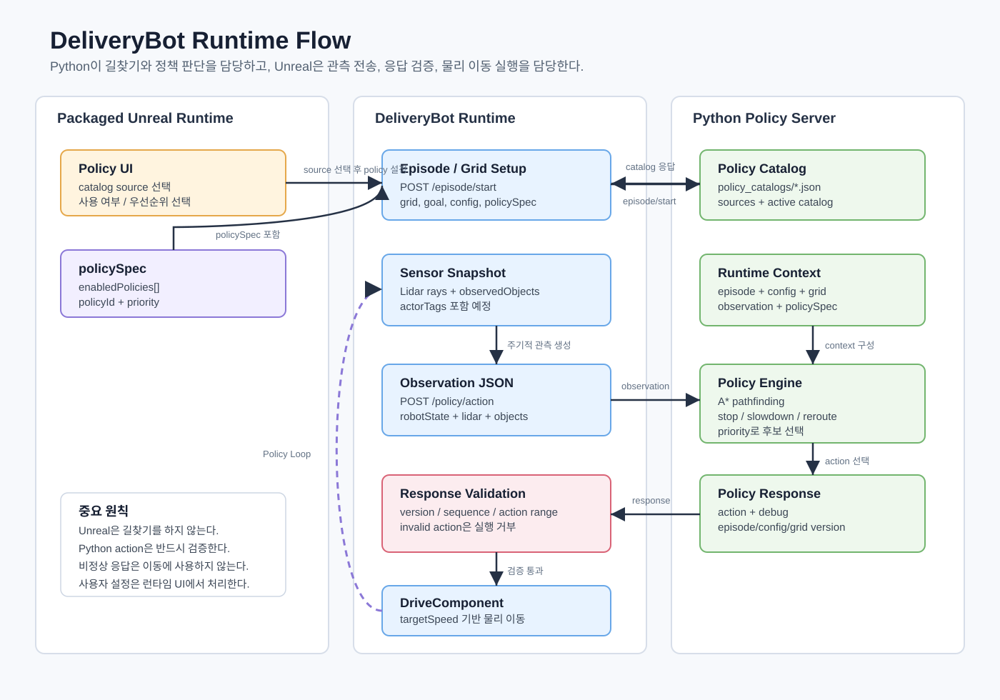
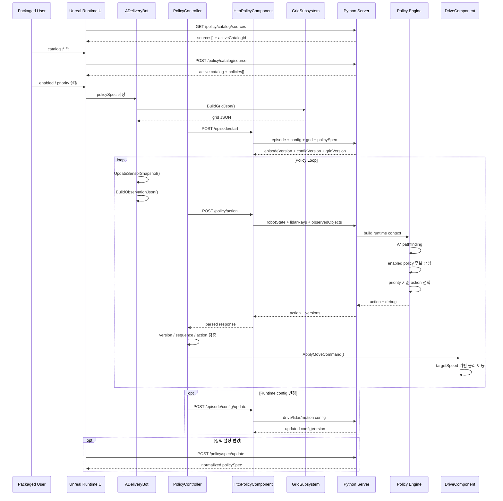
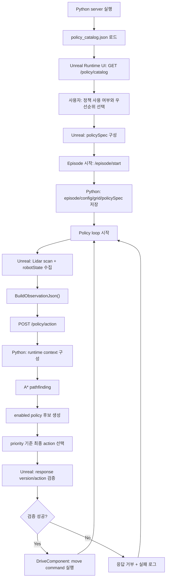

# DeliveryBot Runtime Flow

이 문서는 DeliveryBot이 패키징된 실행 환경에서 Python policy server와 함께 동작하는 전체 흐름을 정리한다.  
기준 날짜: 2026-06-07

## 한눈에 보기



핵심 원칙은 단순하다.

- Python이 길찾기, 정책 판단, 정지, 감속, 우회 판단을 담당한다.
- Unreal은 Episode/Grid/관측 데이터를 Python에 보내고, Python 응답을 검증한 뒤 물리 이동만 실행한다.
- 패키징 사용자에게 Details 패널을 쓰게 하지 않는다.
- 정책 목록은 Python의 `policy_catalogs/*.json`에서 제공하고, Unreal 런타임 UI가 catalog source를 선택한 뒤 해당 내용을 받아 표시한다.
- 사용자가 선택한 정책 사용 여부와 우선순위는 `policySpec`으로 Python에 전달한다.

## 책임 분리

| 영역 | 담당 | 설명 |
| --- | --- | --- |
| Policy catalog 원본 | Python | `Tools/PythonPolicyServer/policy_catalogs/*.json` |
| Catalog 선택 | Unreal Runtime UI | `GET /policy/catalog/sources`로 목록을 받고 `POST /policy/catalog/source`로 active catalog 선택 |
| 정책 목록 표시 | Unreal Runtime UI | 선택된 active catalog의 `policies[]`를 사용자에게 표시 |
| 정책 사용 여부/우선순위 선택 | 사용자 + Unreal UI | 선택 결과를 `policySpec`으로 구성 |
| Grid 생성 | Unreal | Collision Preset과 `GridTrace` 기반으로 `Walkable`, `Penalty`, `Blocked` 생성 |
| 길찾기 | Python | Grid를 기반으로 A* 경로 계산 |
| 정책 판단 | Python | enabled policy 후보를 만들고 priority 기준으로 action 선택 |
| 응답 검증 | Unreal | version, sequence, action 범위 검증 |
| 이동 실행 | Unreal | `UDeliveryBot_DriveComponent`가 `targetSpeedKmh` 기반으로 Chaos Vehicle 이동 |

## 전체 시퀀스



## 흐름도



## Python 정책 엔진 동작 방식

현재 Python 쪽 런타임 정책 구조는 다음 파일들이 담당한다.

| 파일 | 역할 |
| --- | --- |
| `Tools/PythonPolicyServer/policy_catalogs/*.json` | 사용자에게 보여줄 정책 catalog 원본 |
| `Tools/PythonPolicyServer/server.py` | HTTP API, episode/config/grid/policySpec 저장, `/policy/action` 처리 |
| `Tools/PythonPolicyServer/deliverybot_policy/catalog.py` | policy catalog 로드와 `policySpec` 정규화 |
| `Tools/PythonPolicyServer/deliverybot_policy/pathfinding.py` | Grid 기반 A* 길찾기 |
| `Tools/PythonPolicyServer/deliverybot_policy/registry.py` | enabled policy 실행과 최종 후보 선택 |
| `Tools/PythonPolicyServer/deliverybot_policy/actions.py` | action/response helper |
| `Tools/PythonPolicyServer/deliverybot_policy/policies/normal_path_follow.py` | 기본 경로 추종 |
| `Tools/PythonPolicyServer/deliverybot_policy/policies/front_obstacle_stop.py` | 전방 장애물 정지 |
| `Tools/PythonPolicyServer/deliverybot_policy/policies/front_obstacle_slowdown.py` | 전방 장애물 감속 |
| `Tools/PythonPolicyServer/deliverybot_policy/policies/reroute_when_blocked.py` | 경로가 막힌 경우 정지/보고 |

Python은 `/policy/action` 요청을 받을 때 다음 순서로 판단한다.

1. 서버에 저장된 `episodeInfo`, `configInfo`, `gridInfo`, `policySpec`을 observation과 합쳐 runtime context를 만든다.
2. `policySpec.enabledPolicies`에 포함된 정책만 실행한다.
3. 각 정책은 action 후보를 반환할 수도 있고, 상황이 맞지 않으면 후보를 반환하지 않을 수도 있다.
4. 후보가 여러 개면 priority 값이 가장 낮은 후보를 선택한다.
5. 후보가 없으면 fallback stop action을 반환한다.
6. 응답에는 `action`, `debug`, `episodeVersion`, `configVersion`, `gridVersion`이 포함된다.

## 현재 정책 목록

| policyId | 기본 우선순위 | 기본 사용 | 역할 |
| --- | ---: | --- | --- |
| `front_obstacle_stop` | 10 | true | 전방 가까운 장애물이 정지 거리 안에 있으면 정지 |
| `reroute_when_blocked` | 20 | true | 경로 계산 실패 시 정지하고 debug에 실패 상태 기록 |
| `front_obstacle_slowdown` | 30 | true | 전방 장애물이 감속 거리 안에 있으면 저속 경로 추종 |
| `normal_path_follow` | 100 | true | A* 경로를 따라 목표까지 이동 |

## Unreal 동작 방식

### 1. Episode 시작

`ADeliveryBot::BuildEpisodeStartJson()`은 Python에 보낼 초기 정보를 구성한다.

포함되는 주요 데이터:

- `episodeId`
- `robotInstanceId`
- `locationSpec.startLocationCm`
- `locationSpec.goalLocationCm`
- `driveSpec`
- `lidarSpec`
- `motionControlSpec`
- `controlSpec`
- `grid`
- 앞으로 추가할 `policySpec`

Python은 이 정보를 저장하고 다음 version을 반환한다.

- `episodeVersion`
- `configVersion`
- `gridVersion`

### 2. Policy loop

`UDeliveryBot_PolicyControllerComponent::TickPolicy()`가 주기적으로 policy request를 관리한다.

Unreal 쪽 흐름:

1. `ADeliveryBot::UpdateSensorSnapshot()`이 Lidar scan을 갱신한다.
2. `ADeliveryBot::BuildPolicyObservation()`이 policy sequence를 증가시킨다.
3. `ADeliveryBot::BuildObservationJson()`이 observation JSON을 만든다.
4. `UDeliveryBot_HttpPolicyComponent::SendObservationJson()`이 `/policy/action`으로 보낸다.
5. Python 응답을 받으면 `UDeliveryBot_PolicyControllerComponent::HandleParsedPolicyResponse()`가 검증한다.
6. 검증에 성공한 action만 `ADeliveryBot::ApplyMoveCommand()`로 전달된다.

### 3. 응답 검증

Unreal은 Python action을 그대로 실행하지 않는다. 다음 항목을 검증한다.

| 항목 | 조건 |
| --- | --- |
| `status` | `ok` |
| `action` | 존재해야 함 |
| `sequence` | 마지막 수락 응답보다 커야 함 |
| `episodeVersion` | Unreal이 기대하는 값과 같아야 함 |
| `configVersion` | Unreal이 기대하는 값과 같아야 함 |
| `gridVersion` | Unreal이 기대하는 값과 같아야 함 |
| `steering` | `-1.0 ~ 1.0` |
| `brake` | `0.0 ~ 1.0` |
| `targetSpeedKmh` | `0.0` 이상 |
| `direction` | `Forward` 또는 `Reverse` |

검증 실패 응답은 이동에 사용하지 않고 로그 분석용으로 남긴다.

## HTTP API 요약

| API | 방향 | 용도 |
| --- | --- | --- |
| `GET /policy/catalog/sources` | Unreal -> Python | 선택 가능한 정책 catalog 목록 요청 |
| `POST /policy/catalog/source` | Unreal -> Python | 사용할 active catalog 선택 |
| `GET /policy/catalog` | Unreal -> Python | active catalog의 정책 목록 요청 |
| `POST /episode/start` | Unreal -> Python | episode/config/grid/policySpec 초기화 |
| `POST /policy/spec/update` | Unreal -> Python | 실행 중 정책 사용 여부/우선순위 변경 |
| `POST /episode/config/update` | Unreal -> Python | drive/lidar/motion 설정 변경 |
| `POST /grid/update` | Unreal -> Python | grid만 별도 갱신 |
| `POST /policy/action` | Unreal -> Python | 주기적 observation 전송과 action 요청 |
| `GET /episode/status` | Unreal -> Python | 서버 episode 상태 확인 |
| `GET /grid/status` | Unreal -> Python | 서버 grid 상태 확인 |
| `GET /policy/spec/status` | Unreal -> Python | 서버 policySpec 상태 확인 |
| `GET /health` | Unreal -> Python | 서버 기본 상태 확인 |

## policySpec 형식

Unreal 런타임 UI는 사용자가 선택한 정책만 Python으로 보낸다. 전체 catalog를 다시 보낼 필요는 없다.

```json
{
  "policySpec": {
    "catalogId": "default_delivery",
    "catalogVersion": 1,
    "enabledPolicies": [
      {
        "policyId": "front_obstacle_stop",
        "priority": 10
      },
      {
        "policyId": "reroute_when_blocked",
        "priority": 20
      },
      {
        "policyId": "front_obstacle_slowdown",
        "priority": 30
      },
      {
        "policyId": "normal_path_follow",
        "priority": 100
      }
    ]
  }
}
```

Python은 수신한 `policyId`가 catalog와 registry에 있는지 검증하고, 없는 정책은 무시한다.  
`normal_path_follow`는 fallback 성격의 기본 정책이므로, 사용자가 누락해도 Python 쪽에서 보강할 수 있다.

## Observation JSON 핵심 필드

`/policy/action`의 핵심 입력은 다음과 같다.

```json
{
  "sequence": 11,
  "sensorSequence": 86,
  "worldTimeSeconds": 12.34,
  "robotState": {
    "x": 1462.19,
    "y": -1160.01,
    "z": 8.04,
    "yawDegree": -180.0,
    "speedKmh": 1.2
  },
  "observedObjects": [
    {
      "actorName": "BP_RoadCone_C_12",
      "actorTags": ["ObjectType.road_cone"],
      "closestDistanceM": 2.8,
      "closestRayYawDegree": 0.0,
      "totalHitRayCount": 3,
      "frontHitRayCount": 2,
      "inFront": true
    }
  ],
  "lidarRays": [
    {
      "hit": true,
      "rayIndex": 0,
      "rayYawDegree": 0.0,
      "distanceM": 2.8,
      "actorName": "BP_RoadCone_C_12",
      "actorTags": ["ObjectType.road_cone"]
    }
  ]
}
```

`actorTags`는 Episode semantic DataAsset이 연결되기 전까지 Python 정책이 객체 의미를 임시 판단하는 입력으로 사용한다.

## 실행 모드

기존 검증용 mode는 유지한다.

```powershell
py -3 Tools\PythonPolicyServer\server.py --host 127.0.0.1 --port 8000 --policy-mode forward
```

실제 runtime 정책 구조를 테스트할 때는 다음 mode를 사용한다.

```powershell
py -3 Tools\PythonPolicyServer\server.py --host 127.0.0.1 --port 8000 --policy-mode runtime
```

`runtime` mode에서는 `policy_catalog.json`과 `policySpec` 기준으로 Python policy engine이 동작한다.

## 다음 Unreal 작업 기준

이 문서 기준으로 다음 구현 순서는 다음과 같다.

1. `UDeliveryBot_HttpPolicyComponent`에 `GET /policy/catalog/sources` 요청 함수 추가
2. catalog source 응답을 담을 Unreal 구조체 추가
3. `POST /policy/catalog/source` 요청 함수 추가
4. 선택된 active catalog 응답을 파싱할 policy catalog 구조체 추가
5. 런타임 UI에서 catalog source 목록과 policy 목록 표시
6. 사용자의 enabled/priority 선택값으로 `policySpec` 구성
7. `/episode/start`에 `policySpec` 포함
8. 실행 중 변경을 위해 `POST /policy/spec/update` 추가
9. Python `runtime` mode에서 실제 주행 테스트
