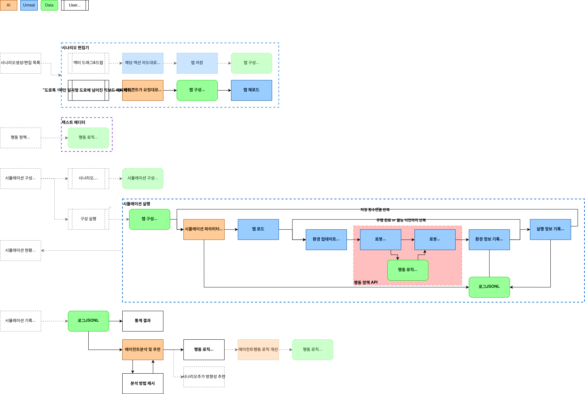

# 인터페이스 설계

## 프로젝트의 목적

주행 로봇 시뮬레이션 환경을 제공하고, 다양한 시나리오에서 로봇의 성능을 평가할 수 있는 플랫폼을 구축한다.
이를 통해 연구자들이 로봇 제어 알고리즘을 개발하고 테스트할 수 있는 환경을 제공한다.

## 정의

- **로봇**
  | 용어                  | 정의                                                      | 모방 대상               |
  | --------------------- | --------------------------------------------------------- | ----------------------- |
  | 지도 정보             | 로봇 주행 환경의 지리적 레이아웃                          | GPS 지도                |
  | 인식 정보             | 로봇의 주변 환경 인식 데이터                              | 카메라, LIDAR, IMU 센서 |
  | 로봇 모델             | 로봇의 물리적 특성과 동작을 모방한 액터                   | 실제 로봇의 물리적 특성 |
  | 행동                  | 로봇이 할 수 있는 동작                                    | 실제 로봇 제어 방식     |
  | 행동 정책(=제어 모델) | 로봇이 주어진 상황에서 행동을 결정하는 알고리즘 또는 모델 | 실제 제어 알고리즘      |

- **시뮬레이션 환경**
  | 용어            | 정의                           | 구성 요소                               |
  | --------------- | ------------------------------ | --------------------------------------- |
  | 환경 요소       | 시나리오를 구성하는 기본 요소  | 도로, 장애물, 보행자 등                 |
  | 시나리오        | 로봇이 수행할 작업과 환경 구성 | 시작/도착 위치, 도로 구성, 장애물 배치  |
  | 에피소드        | 시나리오 수행 단위             | 시작부터 종료까지 일련의 실행 흐름      |
  | 에피소드 구성   | 에피소드를 정의하는 요소       | 시나리오, 로봇 정책, 변경 가능한 설정값 |
  | 시뮬레이션 구성 | 시뮬레이션 실행 단위           | 에피소드 구성, 시뮬레이션 횟수          |
  | 주행 로그       | 에피소드 실행 과정 기록        | 로봇의 인식 정보, 행동, 발생 이벤트     |

- **평가 지표**
  | 용어            | 정의                             | 예시                                               |
  | --------------- | -------------------------------- | -------------------------------------------------- |
  | 에피소드 결과   | 계산으로 얻어지는 결과           | 성공/실패, 주행 시간, 실패 원인                    |
  | 시뮬레이션 통계 | 계산으로 얻어지는 결과 요약      | 성공률, 평균 주행 시간, 충돌 횟수                  |
  | 실패 상황       | 시나리오 실패 조건               | 보행자 충돌, 도로 이탈, 시간 초과, 주행 불능       |
  | 행동 평가       | 한 순간에서의 행동 적절성 평가   | 이상 행동 탐지                                     |
  | 정책 평가       | 행동 정책의 안정성 평가          | 취약한 시나리오 탐지, 개선점 제안                  |
  | 시나리오 평가   | 시나리오의 난이도 및 적합성 평가 | 행동 정책 평가에 적합한 시나리오 식별, 개선점 제안 |

## 프로토콜, 데이터

- **로봇 제어 API**
  | 종류      | 구현   | 형식                   | 구성                        |
  | --------- | ------ | ---------------------- | --------------------------- |
  | 지도 정보 | Unreal | API 파라미터 or 이미지 | 2D Grid                     |
  | 인식 정보 | Unreal | API 파라미터           | Raycast, Transform, Physics |
  | 행동      | Unreal | Unreal API             | 가감속, 스티어링            |
  | 행동 정책 | Python | Python API             | Decision Tree               |

- **사용자 편집 데이터**
  | 종류            | 형식 | 구성                                                                         |
  | --------------- | ---- | ---------------------------------------------------------------------------- |
  | 시나리오 구성   | JSON | 시작/도착 위치, 도로 구성, 장애물 배치, 보행자 출발 위치, 보행자 행동 패턴   |
  | 로봇 구성       | JSON | 최대 속도, 토크, 무게, 센서 범위                                             |
  | 시뮬레이션 구성 | JSON | 사용할 에피소드 조합(시나리오 구성 + 로봇 구성 + 행동 정책), 시뮬레이션 횟수 |

- **내부 처리 데이터**
  | 종류          | 형식  | 구성                                                                        |
  | ------------- | ----- | --------------------------------------------------------------------------- |
  | 에피소드 구성 | JSON  | 시뮬레이션 구성에서 변경 가능한 설정의 샘플링 값                            |
  | 주행 로그     | JSONL | 타임스탬프, 인식 정보, 행동, 발생 이벤트, 전역 상태 업데이트, 에피소드 결과 |

## 실행 흐름

- **플랫폼 전체 실행 흐름**
  1. 시나리오 편집
  2. 행동 정책 편집
  3. 시뮬레이션 구성 편집
  4. 시뮬레이션 실행
  5. 시뮬레이션 기록 확인 및 평가

- **시나리오 편집**
  - 목록: 저장된 시나리오 구성 JSON 파일 목록 읽어서 표시
  - 생성: 사용자가 지정한 이름으로 빈 시나리오 구성 JSON 파일 생성
  - 로드: 사용자가 요청한 시나리오 구성 JSON 파일 로드해 에디터에 규칙대로 액터 배치
  - 편집—에디터
    1. 사용자: 액터 드래그&드랍 배치 / 속성 편집
    2. 에디터: 시나리오 구성 JSON 파일 저장
  - 편집—AI채팅
    1. 사용자: 시나리오 구성을 설명하거나 명시적으로 작업사항을 지시
    2. AI: 시나리오 구성 JSON 파일 생성
    3. 에디터: 시나리오 구성 JSON 파일 로드

- **행동 정책 편집**
  - 목록: 저장된 행동 정책 Python 파일 목록 읽어서 표시
  - 생성: 사용자가 지정한 이름으로 탬플릿 행동 정책 Python 파일 생성
  - 편집—텍스트 에디터
    - 사용자: 텍스트 편집기로 행동 정책 Python 파일 편집

- **시뮬레이션 구성 편집**
  - 목록: 저장된 시뮬레이션 구성 JSON 파일 목록 읽어서 표시
  - 생성: 사용자가 지정한 이름으로 빈 시뮬레이션 구성 JSON 파일 생성
  - 편집: 사용자가 요청한 시뮬레이션 구성 JSON 파일 로드, Form UI로 값 편집 후 저장

- **시뮬레이션 실행**
  1. 사용자: 시뮬레이션 구성 선택 후 실행 요청
  2. 시뮬레이터: 에피소드 구성, 주행 로그 저장할 디렉토리 생성
  3. 시뮬레이터: 시뮬레이션 구성 JSON 파일 로드, 시나리오 액터 배치
  4. 시뮬레이터: 행동 정책 Python API 서버 시작
  5. 시뮬레이터: 지정된 시뮬레이션 횟수만큼 다음 실행
     1. AI: 에피소드 구성 샘플링, 저장
     2. 시뮬레이터: 에피소드 구성 로드
     3. 시뮬레이터: 시나리오 액터 배치 초기화, 로봇 초기화
     4. 시뮬레이터: 에피소드 시뮬레이션 루프 시작
        1. 시뮬레이터: 환경 상태 업데이트 (물리 시뮬레이션, 보행자 이동 등)
        2. 시뮬레이터: 로봇 인식 정보 업데이트
        3. 시뮬레이터: 행동 정책 Python API 호출
        4. 행동 정책: 주어진 인식 정보로 행동 결정 반환
          - 지도 정보 업데이트 필요할 경우(예: 경로 재탐색) 시뮬레이터 API 호출
        5. 시뮬레이터: 로봇 행동 적용
        6. 시뮬레이터: 인식 정보, 행동을 주행 로그에 기록
        7. 시뮬레이터: 이벤트 탐지 (예: 충돌, 경로 이탈)
           1. 시뮬레이터: 이벤트 정보를 주행 로그에 기록
           2. 시뮬레이터: 실패 조건 충족 시 에피소드 종료
        8. 시뮬레이터: 종료 조건 충족 시 에피소드 종료
     5. 시뮬레이터: 에피소드 결과 계산, 시뮬레이션 통계 업데이트

- **시뮬레이션 기록 확인 및 평가**
  - 목록: 시뮬레이션 결과 디렉토리 목록 읽어서 표시
  - 사용자: 시뮬레이션 결과 선택 시 상세 정보 표시
    - 시뮬레이션 통계 표시
    - 에피소드 결과 목록 표시
    - 에피소드 결과 선택 시 해당 에피소드 주행 로그 시각화
    - AI: 시뮬레이션 통계, 에피소드 결과, 주행 로그 분석해 개선점 제안
      - 실패 상황 원인 분석
      - 이상 행동 탐지 및 원인 분석
      - 평가 지표 계산 방법 제안
      - 행동 정책 개선점 제안, 행동 정책 Python 파일 자동 수정
      - 시나리오 개선점 제안, 시나리오 구성 JSON 파일 자동 수정