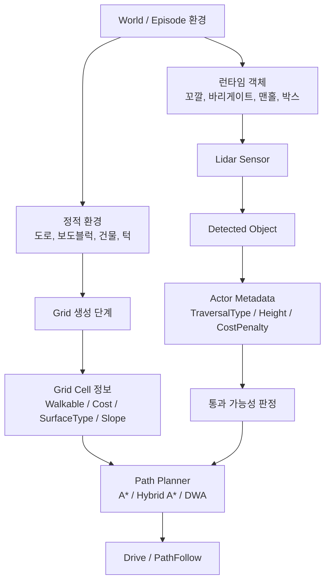
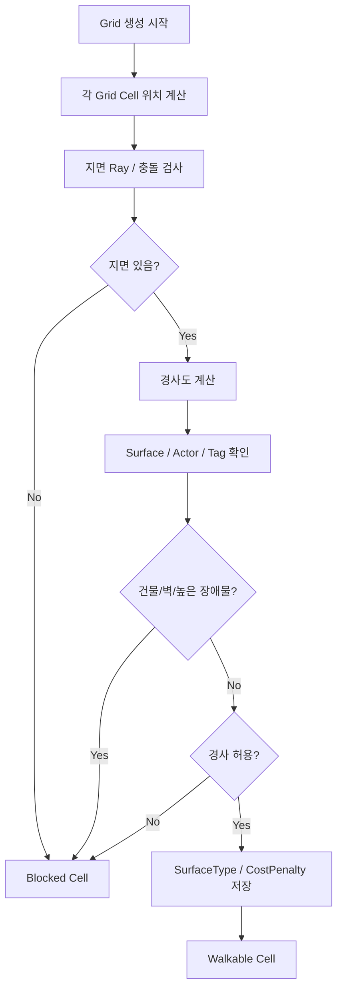
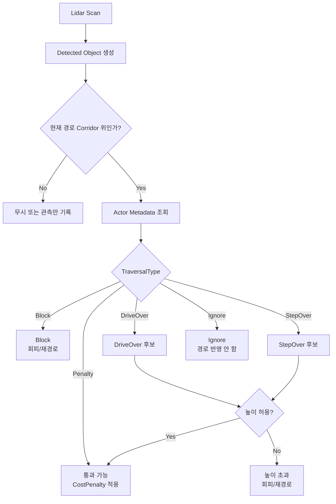
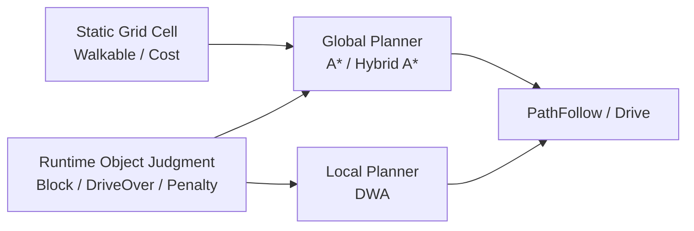
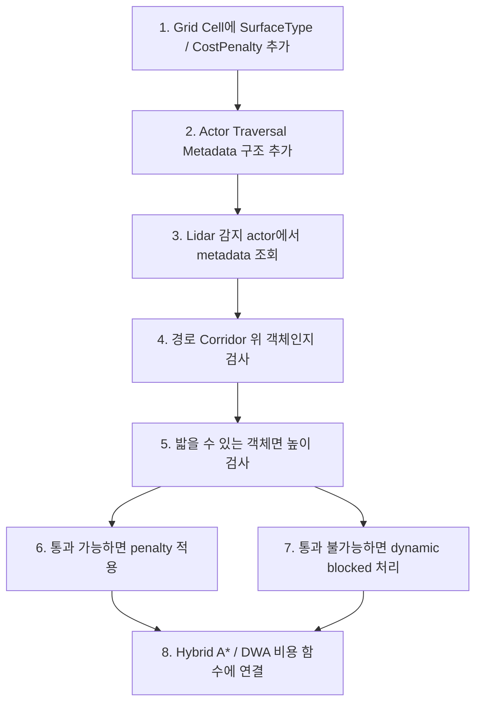

# 환경/장애물 판별 흐름

## 목적

DeliveryBot이 주행할 때 도로, 보도블럭, 건물, 꼬깔, 바리게이트, 맨홀 같은 환경 요소를 어떻게 판별하고 경로 계획에 반영할지 정리한다.

핵심 방향은 다음과 같다.

- 도로, 보도블럭, 건물처럼 거의 변하지 않는 환경은 Grid 생성 시점에 판별한다.
- 꼬깔, 바리게이트, 맨홀처럼 런타임에서 마주치는 소형 장애물은 Lidar와 actor metadata로 판별한다.
- 밟을 수 있는 물체는 높이와 통과 비용을 보고 지나간다.
- 밟을 수 없는 물체는 dynamic blocked 또는 회피 대상으로 처리한다.

## 전체 구조

## 정적 환경 판별

도로, 보도블럭, 건물, 벽, 지형 턱처럼 시뮬레이션 중 크게 변하지 않는 요소는 Grid 생성 시점에 미리 판별한다.

### 정적 Grid Cell에 저장할 정보

| 정보 | 의미 | 사용 위치 |
| --- | --- | --- |
| `bWalkable` | 이동 가능한 셀인지 여부 | A*, Hybrid A*, DWA 후보 검사 |
| `SurfaceType` | 도로, 보도, 턱, 건물 등 표면/환경 종류 | 비용 계산, 디버그 시각화 |
| `CostPenalty` | 지나갈 수 있지만 선호하지 않는 정도 | 경로 탐색 비용 |
| `GroundHeightCm` | 지면 높이 | 차량 높이 보정, 턱 판단 |
| `SlopeDegree` | 경사도 | 이동 가능 여부, 비용 |
| `BlockingActor` | 셀을 막는 actor | 디버깅, 분석 로그 |

## 런타임 장애물 판별

꼬깔, 바리게이트, 맨홀, 작은 박스처럼 주행 중 만나는 객체는 Lidar 감지 이후 별도로 판정한다.

## Actor Metadata 구조

Lidar는 "앞에 무언가 있다"는 정보를 준다. 하지만 그 객체가 밟을 수 있는지, 피해야 하는지, 비용만 추가하면 되는지는 actor metadata가 담당하는 것이 좋다.

| 필드 | 예시 | 의미 |
| --- | --- | --- |
| `ObstacleType` | `Cone`, `Barricade`, `Manhole`, `Box`, `Building`, `Curb` | 객체 종류 |
| `TraversalType` | `Block`, `DriveOver`, `StepOver`, `Penalty`, `Ignore` | 통과 정책 |
| `MaxTraversableHeightCm` | `8.0` | 로봇이 밟고 지나갈 수 있는 최대 높이 |
| `CostPenalty` | `1.5` | 지나갈 수 있지만 선호하지 않는 비용 |
| `bAffectsGlobalPath` | `true` | 전역 경로 재계산에 반영할지 여부 |
| `bAffectsLocalAvoidance` | `true` | DWA/로컬 회피에 반영할지 여부 |
| `DebugColor` | `Yellow` | 디버그 시각화 색상 |

## 객체별 권장 판정

| 객체 | 기본 분류 | 기본 처리 | 높이 검사 | 경로 반영 |
| --- | --- | --- | --- | --- |
| 도로 | Static Surface | 이동 가능 | Grid 생성 시 경사 검사 | 낮은 cost |
| 보도블럭 | Static Surface | 이동 가능 또는 패널티 | Grid 생성 시 높이/경사 검사 | 중간 cost |
| 건물 | Static Obstacle | 이동 불가 | 불필요 | blocked |
| 벽 | Static Obstacle | 이동 불가 | 불필요 | blocked |
| 턱 | Static/Semi-static | 높이에 따라 통과/차단 | 필요 | penalty 또는 blocked |
| 꼬깔 | Runtime Object | 보통 회피, 낮으면 통과 가능 | 필요 | local/global 반영 |
| 바리게이트 | Runtime Object | 회피 | 보통 불필요 | blocked |
| 맨홀 | Runtime Object/Surface | 낮으면 통과 | 필요 | penalty |
| 작은 박스 | Runtime Object | 높이에 따라 통과/회피 | 필요 | penalty 또는 blocked |
| 사람/차량 | Runtime Dynamic Object | 회피 | 불필요 | dynamic blocked/local avoidance |

## TraversalType 의미

| Type | 의미 | 처리 |
| --- | --- | --- |
| `Block` | 통과 불가 | dynamic blocked 처리, 재경로 또는 DWA 회피 |
| `DriveOver` | 바퀴로 밟고 지나갈 수 있음 | 높이 검사 후 cost penalty 적용 |
| `StepOver` | 낮은 턱처럼 조건부 통과 가능 | 높이/경사 검사 후 cost penalty 적용 |
| `Penalty` | 통과 가능하지만 선호하지 않음 | blocked는 아니고 비용 증가 |
| `Ignore` | 주행 판단에 반영하지 않음 | 관측 로그만 남김 |

## 경로 계획 반영 방식

| 상황 | Global Planner 반영 | Local Planner 반영 |
| --- | --- | --- |
| 건물/벽 | 항상 blocked | 거의 필요 없음 |
| 도로/보도 비용 | 기본 cost로 반영 | 필요 시 속도 제한 |
| 낮은 맨홀 | penalty cost | 속도 감속 가능 |
| 낮은 턱 | penalty 또는 조건부 통과 | 속도 감속 가능 |
| 꼬깔 | 경로 위에 있으면 dynamic blocked 또는 penalty | 회피 우선 |
| 바리게이트 | dynamic blocked | 회피 우선 |
| 사람/차량 | 상황에 따라 dynamic blocked | 회피/정지 우선 |

## 현재 구현 방향과의 일치 여부

이 흐름은 현재 구현 방향과 잘 맞는다.

| 현재 구현 요소 | 일치하는 부분 |
| --- | --- |
| `UDeliveryBot_GridSubsystem` | Grid 생성 시 지면/충돌/경사 기반으로 이동 가능 셀을 만든다. 정적 환경 판별 책임과 맞다. |
| `UDeliveryBot_LidarSensorComponent` | 런타임 객체 감지와 전방 객체 탐지 흐름과 맞다. |
| `FDeliveryBotLidarDetectedObjectInfo` | 감지 객체별 거리, ray 수, 전방 여부를 담을 수 있어 runtime object 판단 입력으로 적합하다. |
| `UDeliveryBot_GlobalPathComponent` | Grid와 dynamic blocked 정보를 기반으로 전역 경로 재생성에 연결하기 좋다. |
| `UDeliveryBot_PathFollowComponent` | 생성된 경로와 이동 방향을 따라가는 역할이므로, 판별 결과가 반영된 경로를 소비하는 위치와 맞다. |
| `UDeliveryBot_DriveComponent` | 최종 이동 명령을 차량 입력으로 적용하므로, 높이/회피 판정 이후의 결과를 실행하는 역할과 맞다. |

## 추가로 필요한 구조

현재 흐름을 더 안정적으로 구현하려면 아래 구조가 추가되는 것이 좋다.

| 추가 구조 | 역할 |
| --- | --- |
| `FDeliveryBotSurfaceCellInfo` | Grid Cell의 surface type, cost penalty, slope, height를 저장 |
| `UDeliveryBot_TraversabilityComponent` 또는 `UDeliveryBot_ObstacleClassifierComponent` | actor가 밟을 수 있는지, 피해야 하는지 판정 |
| `FDeliveryBotObstacleTraversalInfo` | actor별 traversal type, max height, penalty 저장 |
| `EDeliveryBotObstacleType` | Cone, Barricade, Manhole, Building 등 의미 분류 |
| `EDeliveryBotTraversalType` | Block, DriveOver, StepOver, Penalty, Ignore |
| `DynamicBlocked` 관리 API | 런타임 장애물을 Grid/Planner에 반영 |

## 권장 구현 순서

## 최종 판단

제안한 흐름은 괜찮다. 오히려 현실적인 이동 로봇 구조에 가깝다.

핵심은 정적 환경과 런타임 객체를 같은 방식으로 처리하지 않는 것이다.

- 정적 환경은 Grid 생성 때 비용과 이동 가능 여부로 정리한다.
- 런타임 객체는 Lidar 감지 이후 actor metadata와 높이 검사로 통과/회피를 판단한다.
- 밟을 수 있는 객체도 무조건 선호하지 않고 cost penalty를 둔다.
- 밟을 수 없는 객체는 dynamic blocked 또는 local avoidance 대상으로 처리한다.

따라서 현재 구현 방향과도 일치하며, 다음 단계는 "장애물 감지"보다 "장애물의 의미와 통과 가능성 판정"을 데이터 구조로 분리하는 것이다.

