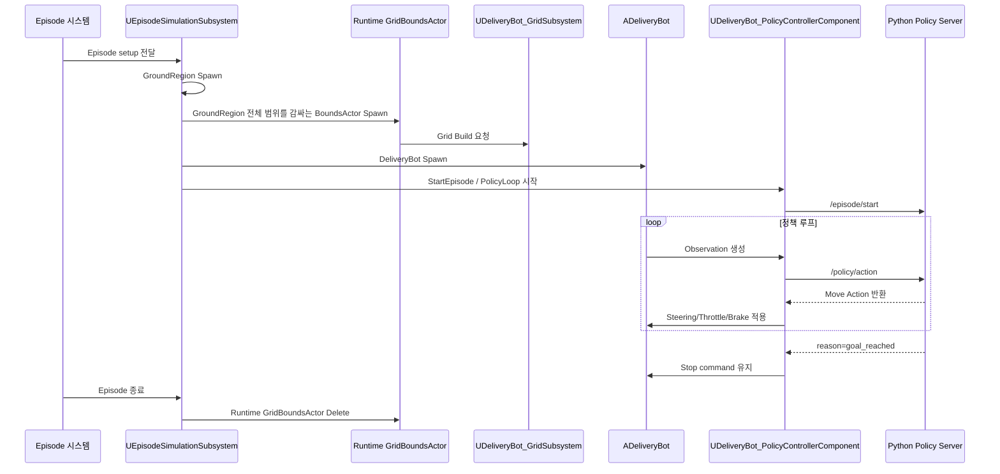

# DeliveryBot Codex 인수인계 문서

작성일: 2026-06-09

이 문서는 다른 계정의 Codex 환경에서 현재 DeliveryBot 작업을 이어가기 위한 인수인계 문서다.

## 작업 목표

현재 목표는 `EpisodeSimulationMap`에서 Episode 시스템이 DeliveryBot을 소환하고, 소환된 DeliveryBot이 Python 정책 서버의 정책 판단에 따라 시작 위치에서 목표 위치까지 자동 주행하는 것이다.

버튼을 눌러 수동 시작하는 흐름은 보류 상태다. 지금은 Episode가 시작되면 DeliveryBot이 소환되고, 그 이후 자동으로 정책 기반 이동이 시작되는 흐름을 우선 목표로 한다.

## 현재 완료된 작업

| 구분 | 상태 | 내용 |
| --- | --- | --- |
| Python 정책 서버 | 완료 | 정책 카탈로그, 정책 확정, 정책별 선택 구조, 경로 추종, 장애물 감속/정지/우회, goal reached 처리 구현 |
| 정책 Spec JSON | 완료 | 정책 조합별 JSON 파일을 `Json/Input/PolicySpecs` 아래로 분리 |
| Unreal HTTP 연동 | 완료 | `/policy/spec/update`, `/episode/start`, `/policy/action` 연동 |
| Episode 소환 연동 | 완료 | `EpisodeSimulationSubsystem`에서 DeliveryBot 소환 흐름과 정책 시작 흐름 연결 |
| Runtime GridBoundsActor | 완료 | Episode GroundRegion 범위를 기준으로 GridBoundsActor를 자동 Spawn/Delete하도록 수정 |
| 로그 억제 | 완료 | 반복 정책 로그를 기본적으로 꺼두고, 필요할 때만 켤 수 있게 Bool/옵션 추가 |
| 정책별 A* 옵션 | 완료 | Python A*가 `policySpec.enabledPolicies[].pathfinding` 설정을 읽도록 보강 |
| 동적 장애물 A* 회피 | 완료 | `front_obstacle_slowdown`이 Lidar hit 지점을 임시 Blocked cell로 반영해 우회 경로 계산 |
| Stop 지속 후 A* 회피 | 완료 | `front_obstacle_stop`이 3초 이상 지속되면 정지 대신 DynamicObstacle A* 회피 후보 반환 |
| Stop 회피 실패 복구 전략 | 완료 | 같은 장애물로 A* 재탐색 3회 후 `reverse_then_reroute` 또는 `grace_forward` 전략 선택 가능 |
| UI 정책 선택 | 보류 | WBP/Web 방향이 확정되지 않아 임시 확정 JSON 방식 유지 |
| 패키징 검증 | 보류 | 추후 패키징 시 JSON 경로 포함 여부 확인 필요 |

## 핵심 런타임 흐름



## 주요 변경 파일

| 파일 | 역할 |
| --- | --- |
| `Source/ProtoRobotSim/Public/Episode/EpisodeSimulationSubsystem.h` | Runtime GridBoundsActor 소유 변수와 Grid 생성/검증 함수 선언 |
| `Source/ProtoRobotSim/Private/Episode/EpisodeSimulationSubsystem.cpp` | GroundRegion 범위 계산, GridBoundsActor Spawn/Delete, Grid rebuild, DeliveryBot spawn 전 Grid 검증 |
| `Source/ProtoRobotSim/Public/DeliveryBot/Actor/DeliveryBot.h` | 정책 Observation 요청 로그를 켜고 끄는 `bLogPolicyObservationRequests` 추가 |
| `Source/ProtoRobotSim/Private/DeliveryBot/Actor/DeliveryBot.cpp` | Observation 요청 성공 로그를 Bool로 제어하고, 실제 실패일 때만 Warning 출력 |
| `Source/ProtoRobotSim/Public/DeliveryBot/Component/DeliveryBot_HttpPolicyComponent.h` | HTTP 정책 응답 Body 로그 제어용 `bLogPolicyResponseBody` 추가 |
| `Source/ProtoRobotSim/Private/DeliveryBot/Component/DeliveryBot_HttpPolicyComponent.cpp` | `/policy/action` 응답 Body 반복 로그를 Bool로 제어 |
| `Source/ProtoRobotSim/Public/DeliveryBot/Component/DeliveryBot_PolicyControllerComponent.h` | 정책 응답/선택 로그 제어용 `bLogPolicyRuntimeMessages` 추가 |
| `Source/ProtoRobotSim/Private/DeliveryBot/Component/DeliveryBot_PolicyControllerComponent.cpp` | 정책 응답 수신, Valid action 로그를 Bool로 제어 |
| `Tools/PythonPolicyServer/server.py` | Python 서버 런타임 반복 로그를 `--verbose-runtime-log` 옵션으로 제어 |
| `Tools/PythonPolicyServer/deliverybot_policy/pathfinding.py` | 정책별 옵션을 반영하는 Grid A* 길찾기 |
| `Tools/PythonPolicyServer/deliverybot_policy/dynamic_obstacles.py` | Lidar ray hit 지점을 임시 DynamicObstacle Blocked cell로 변환 |
| `Tools/PythonPolicyServer/deliverybot_policy/catalog.py` | `policySpec` 정규화 시 `pathfinding`/`parameters` 설정 보존 |
| `Tools/PythonPolicyServer/deliverybot_policy/policies/front_obstacle_stop.py` | Stop 지속 시간 추적, 3초 후 DynamicObstacle A* 회피 |
| `Tools/PythonPolicyServer/deliverybot_policy/policies/normal_path_follow.py` | `normal_path_follow` 정책에서 정책별 A* 옵션 사용 |
| `Tools/PythonPolicyServer/deliverybot_policy/policies/reroute_when_blocked.py` | `reroute_when_blocked` 정책에서 정책별 A* 옵션 사용 |
| `Tools/PythonPolicyServer/deliverybot_policy/policies/front_obstacle_slowdown.py` | 전방 장애물 감지 시 DynamicObstacle overlay를 적용한 A* 경로 추종 |
| `Json/Input/PolicySpecs/*.json` | 임시/테스트용 정책 확정 Spec 파일 |
| `Json/Input/PolicySpecs/PolicySpec_AStarPolicyOptionsExample.json` | 정책별 A* 옵션 예시 |
| `Docs/바꿔야하는테스트모음.md` | 나중에 UI/Web/패키징 시 다시 확인할 임시 작업 목록 |

## 현재 구현 방식

### EpisodeSimulationSubsystem

`UEpisodeSimulationSubsystem`이 Episode 실행 시 GroundRegion을 먼저 소환한다.

그 후 GroundRegion들의 위치와 크기를 이용해 전체 XY 범위를 계산하고, 그 범위를 감싸는 `ADeliveryBot_GridBoundsActor`를 런타임에 소환한다.

소환된 GridBoundsActor를 `UDeliveryBot_GridSubsystem::BuildGridFromBounds()`에 전달해서 DeliveryBot용 Grid를 생성한다.

Episode가 끝나거나 정리될 때는 `ClearEpisode()`에서 Runtime GridBoundsActor를 Destroy하고 포인터를 비운다.

### DeliveryBot 자동 주행

DeliveryBot이 소환되면 정책 Spec이 확정된 상태를 기준으로 `/episode/start`를 보내고, 이후 `/policy/action`을 반복 호출한다.

Python 정책 서버는 활성화된 정책 목록과 우선순위를 기준으로 매 Observation마다 하나의 정책을 선택한다.

현재 확인된 정책은 다음 4개다.

| Policy ID | 역할 |
| --- | --- |
| `front_obstacle_stop` | 전방 가까운 장애물 감지 시 정지 |
| `reroute_when_blocked` | 경로가 막혔을 때 우회 경로 시도 |
| `front_obstacle_slowdown` | 전방 장애물이 일정 거리 안에 있으면 감속 |
| `normal_path_follow` | 기본 경로 추종 |

사용자가 4가지 정책 모두 정상 동작을 확인했다.

### Goal 도착 처리

Python에서 `reason=goal_reached`가 나오면 DeliveryBot은 Stop command를 유지한다.

최종 도착 판정은 Episode 담당자가 구현한 `Evaluation Subsystem`에서 수행한다. 즉, Python의 goal reached는 주행을 멈추기 위한 신호이고, Episode 성공/실패의 최종 판정은 Evaluation 쪽 판단을 따른다.

## 로그 제어

기본값은 반복 로그를 최대한 끄는 방향이다.

| 위치 | 옵션 | 기본값 | 설명 |
| --- | --- | --- | --- |
| `ADeliveryBot` | `bLogPolicyObservationRequests` | `false` | `Policy observation request sent` 로그 출력 여부 |
| `UDeliveryBot_HttpPolicyComponent` | `bLogPolicyResponseBody` | `false` | `/policy/action` 응답 Body 전체 로그 출력 여부 |
| `UDeliveryBot_PolicyControllerComponent` | `bLogPolicyRuntimeMessages` | `false` | 정책 응답 수신/Valid action 로그 출력 여부 |
| Python 서버 | `--verbose-runtime-log` | 꺼짐 | observation, selected policy, HTTP access log 출력 여부 |

Python 서버 로그를 다시 보고 싶으면 서버 실행 시 `--verbose-runtime-log`를 붙인다.

```powershell
python Tools\PythonPolicyServer\server.py --policy-mode runtime --verbose-runtime-log
```

로그를 조용하게 유지하려면 옵션 없이 실행한다.

```powershell
python Tools\PythonPolicyServer\server.py --policy-mode runtime
```

주의: `server.py`를 수정한 뒤에는 이미 떠 있는 Python 서버를 재시작해야 변경 사항이 적용된다.

## 현재 검증 상태

| 항목 | 상태 |
| --- | --- |
| Python `server.py` 문법 검사 | 통과 |
| DeliveryBot 4개 정책 동작 | 사용자 확인 완료 |
| Goal 도착 후 정지 | 사용자 확인 완료 |
| Runtime GridBoundsActor 자동 Spawn/Delete | 코드 반영 완료, UE 빌드/PIE 검증 필요 |
| 반복 로그 억제 | 코드 반영 완료, UE 빌드/PIE 검증 필요 |

Python 문법 검사는 다음 방식으로 통과했다.

```powershell
python -m py_compile Tools\PythonPolicyServer\server.py
```

다만 이 문서가 다른 계정에서 사용될 수 있으므로, 실제 Python 실행기는 해당 계정의 환경에 맞게 사용하면 된다.

## 다음 Codex가 먼저 해야 할 일

1. Unreal C++ 빌드를 실행한다.
   - IDE 또는 Unreal Editor의 일반 빌드 방식을 사용한다.
   - 로컬 UE 설치 경로를 코드나 문서에 하드코딩하지 않는다.

2. `/Game/Maps/EpisodeSimulationMap.EpisodeSimulationMap`에서 미리 배치해 둔 `BP_DeliveryBot_GridBoundsActor`가 있다면 제거한다.
   - 이제 Episode 실행 중 `UEpisodeSimulationSubsystem`이 Runtime GridBoundsActor를 직접 Spawn/Delete해야 한다.

3. Python 정책 서버를 실행한다.

```powershell
python Tools\PythonPolicyServer\server.py --policy-mode runtime
```

4. Episode 실행 흐름으로 DeliveryBot을 소환한다.
   - 버튼 기반 시작은 현재 보류다.
   - Episode 시스템이 DeliveryBot을 소환하고 자동 주행을 시작해야 한다.

5. Unreal 로그에서 다음을 확인한다.

```text
DeliveryBot grid rebuilt from episode ground regions.
```

6. DeliveryBot이 시작 위치에서 목표 위치까지 움직이는지 확인한다.

7. Episode 종료 시 Runtime GridBoundsActor가 삭제되는지 확인한다.

8. 반복 로그가 조용해졌는지 확인한다.
   - 경고나 오류 로그는 계속 나오는 것이 정상이다.

## 주의해야 할 부분

### GridBoundsActor의 BeginPlay 중복 Build 가능성

`ADeliveryBot_GridBoundsActor::BeginPlay()`가 자체적으로 Grid Build를 요청하는 구조라면, Runtime Spawn 시 한 번 Build되고 `EpisodeSimulationSubsystem`에서 다시 Build될 수 있다.

현재는 큰 문제는 아니지만, 중복 Build 로그나 불필요한 동작이 보이면 다음 개선을 고려한다.

| 개선안 | 설명 |
| --- | --- |
| `bBuildGridOnBeginPlay` 추가 | 에디터에 직접 배치한 경우만 BeginPlay에서 Build |
| Subsystem Spawn 전용 플래그 추가 | Runtime Spawn에서는 BeginPlay 자동 Build를 끄고 Subsystem이 명시적으로 Build |

### GroundRegion 타입

현재 GridBounds 계산은 Rectangle GroundRegion 기준이다.

Episode 쪽에서 ConvexPolygon 등 다른 형태의 GroundRegion을 추가한다면 `ExpandXYBoundsWithGroundRegion()`도 함께 확장해야 한다.

### Static Obstacle과 Grid 생성 순서

현재 흐름은 GroundRegion을 기준으로 Grid를 만들고 DeliveryBot을 움직인다.

Static Obstacle을 Grid 경로계획에 직접 반영해야 한다면 다음 순서를 검토해야 한다.

```text
GroundRegion Spawn
StaticObstacle Spawn
Grid Rebuild
DeliveryBot Spawn
Episode Start
```

현재 정책은 Lidar Observation을 통해 Runtime 장애물을 보고 정지/감속/우회 정책을 선택한다.

## 정책별 A* 옵션

Python A*는 이제 정책별로 다음 위치의 설정을 읽는다.

```json
{
  "policyId": "normal_path_follow",
  "priority": 100,
  "pathfinding": {
    "allowDiagonal": true,
    "preventCornerCutting": true,
    "penaltyMinimumCost": 5.0,
    "penaltyCostMultiplier": 1.0,
    "heuristicWeight": 1.0,
    "maxExpandedNodes": 100000
  }
}
```

전방 장애물을 라이다로 감지했을 때 A*가 임시 장애물 셀을 피해가게 하려면 `front_obstacle_slowdown`에 다음 설정을 둘 수 있다.

```json
{
  "policyId": "front_obstacle_slowdown",
  "priority": 30,
  "dynamicObstacles": {
    "enabled": true,
    "frontOnly": true,
    "inflationRadiusM": 0.9,
    "maxDistanceM": 5.0
  }
}
```

`front_obstacle_stop`은 같은 전방 장애물이 stop 거리 안에서 3초 이상 유지되면 정지 대신 동적 장애물 A* 회피를 시도한다.

```json
{
  "policyId": "front_obstacle_stop",
  "priority": 10,
  "stopRerouteDelaySeconds": 3.0,
  "dynamicObstacles": {
    "enabled": true,
    "frontOnly": true,
    "inflationRadiusM": 0.75,
    "maxDistanceM": 3.5
  },
  "recovery": {
    "strategy": "reverse_then_reroute",
    "rerouteAttemptLimit": 3,
    "rerouteAttemptIntervalSeconds": 0.75,
    "reverseDurationSeconds": 0.8,
    "reverseSpeedKmh": 1.0
  }
}
```

같은 장애물 때문에 A* 회피를 3회 시도해도 계속 막히면 `recovery.strategy`에 따라 다음 행동이 달라진다.

| `recovery.strategy` | 동작 |
| --- | --- |
| `reverse_then_reroute` | 짧게 후진한 뒤 시도 횟수를 초기화하고 다시 A* 회피 |
| `grace_forward` | GraceTime 동안 stop 정책을 무시하고 저속 경로 추종 |
| `stop` | 시도 횟수 초과 후 계속 안전 정지 |
| `reroute` | 시도 횟수 제한 없이 계속 A* 회피 시도 |

지원하는 대표 옵션은 다음과 같다.

| 옵션 | 기본값 | 설명 |
| --- | --- | --- |
| `allowDiagonal` | `true` | 대각선 이동 허용 여부 |
| `preventCornerCutting` | `true` | 대각선 이동 시 막힌 셀 모서리를 관통하지 못하게 함 |
| `penaltyMinimumCost` | `5.0` | Penalty 셀의 최소 이동 비용 |
| `penaltyCostMultiplier` | `1.0` | Penalty 셀 비용 배율 |
| `walkableCostMultiplier` | `1.0` | Walkable 셀 비용 배율 |
| `heuristicWeight` | `1.0` | 휴리스틱 가중치 |
| `maxExpandedNodes` | `100000` | A* 탐색 최대 노드 수 |
| `dynamicObstacles.inflationRadiusM` | `0.9` | 라이다 hit 지점 주변을 막힌 셀로 부풀리는 반경 |
| `dynamicObstacles.frontOnly` | `true` | 전방 ray hit만 동적 장애물로 사용할지 여부 |
| `dynamicObstacles.maxDistanceM` | `slowDownDistanceM` | 동적 장애물로 반영할 최대 거리 |
| `stopRerouteDelaySeconds` | `3.0` | `front_obstacle_stop`이 지속된 뒤 A* 회피로 전환하는 시간 |
| `recovery.rerouteAttemptLimit` | `3` | 같은 장애물에 대한 A* 회피 시도 제한 |
| `recovery.rerouteAttemptIntervalSeconds` | `0.75` | 회피 시도 횟수를 하나 올리는 최소 간격 |
| `recovery.reverseDurationSeconds` | `0.8` | 후진 복구 지속 시간 |
| `recovery.reverseSpeedKmh` | `1.0` | 후진 복구 속도 |
| `recovery.graceDurationSeconds` | `1.5` | Grace forward 지속 시간 |
| `recovery.graceSpeedKmh` | `1.0` | Grace forward 속도 |

예시는 `Json/Input/PolicySpecs/PolicySpec_AStarPolicyOptionsExample.json`에 있다.

## 보류된 작업

| 작업 | 이유 |
| --- | --- |
| 정책 선택 UI | Unreal WBP로 할지 Web으로 할지 미확정 |
| DeliveryBot 수치 조절 UI | UI 방향 미확정 |
| 정책 변경 기록/실험 기록 | 현재 목표가 시작부터 골까지 주행이라 보류 |
| 패키징 JSON 포함 검증 | 아직 패키징 단계가 아니라 보류 |

보류 내용은 `Docs/바꿔야하는테스트모음.md`에도 계속 누적한다.

## 다음 구현 후보

우선순위는 다음 순서를 추천한다.

| 순서 | 작업 | 목적 |
| --- | --- | --- |
| 1 | UE 빌드 및 PIE 검증 | 현재 코드가 실제로 컴파일되고 동작하는지 확인 |
| 2 | Runtime GridBoundsActor 중복 Build 여부 확인 | 불필요한 Grid Build 제거 여부 판단 |
| 3 | Episode 종료 시 DeliveryBot/Bounds/Grid 정리 확인 | 다음 Episode에 이전 상태가 섞이지 않도록 보장 |
| 4 | Spawn된 DeliveryBot의 정책 Spec 확정 타이밍 점검 | Episode 시작 전에 항상 정책이 준비되도록 안정화 |
| 5 | Evaluation Subsystem과 종료 이벤트 연결 확인 | Goal 도착 후 Episode 성공 판정까지 자연스럽게 연결 |
| 6 | 정책 UI/Web 결정 후 Spec 생성 로직 이전 | 임시 JSON 확정 방식을 정식 사용자 설정 흐름으로 교체 |

## 다른 Codex에게 남기는 메모

- 사용자는 코드 중심 설명을 선호한다.
- Unreal 쪽은 사용자가 직접 수정하고 싶어하는 경우가 많으므로, 명시적으로 수정 요청이 없으면 함수 단위 코드와 붙여넣기 위치를 안내하는 방식이 좋다.
- 단, 이번 문서 작성 시점까지는 사용자가 여러 번 직접 수정을 요청했고, 일부 C++/Python 코드는 Codex가 이미 수정했다.
- Blueprint 작업은 초보자도 따라할 수 있게 단계별로 설명해야 한다.
- 문서는 한국어로 작성한다.
- `.uasset`, `.umap` 편집은 직접 파일 패치하지 말고 Unreal Editor, MCP, 또는 프로젝트 도구를 사용한다.
- C++ 빌드는 로컬 UE 설치 경로를 하드코딩하지 않는다.
