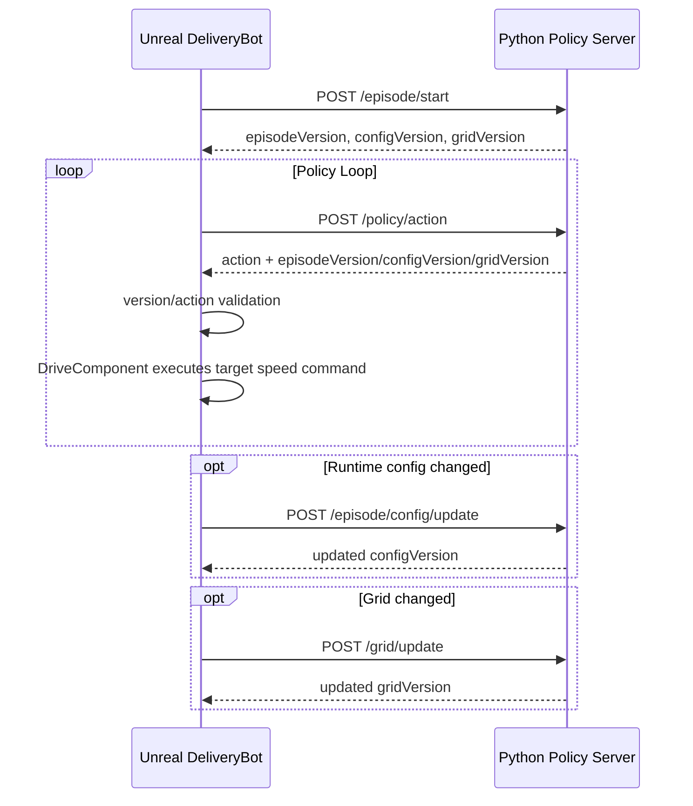

# DeliveryBot Python API Current

이 문서는 현재 `ADeliveryBot`과 Python policy server 사이에서 사용하는 HTTP API 계약을 정리한다.

현재 방향은 다음과 같다.

- Python이 길찾기와 정책 판단을 담당한다.
- Unreal은 Grid, Episode 설정, 로봇 상태, 라이다 관측값을 Python에 전달한다.
- Unreal은 Python이 반환한 action을 검증한 뒤 실행한다.
- Unreal은 별도의 길찾기를 하지 않는다.
- 단, 비정상 action은 Unreal에서 거부하고 실패 로그를 남긴다.

## 전체 구조

| 구분 | 변경 빈도 | 전송 API | 주요 데이터 |
|---|---:|---|---|
| Episode 시작 정보 | Episode 시작 시 | `POST /episode/start` | `episodeId`, `robotInstanceId`, start, goal, 초기 config, grid |
| Runtime 설정 변경 | 가끔 | `POST /episode/config/update` | drive, lidar, motion control 설정 |
| Grid 정보 | 맵/Grid 변경 시 | `POST /grid/update` | Walkable, Penalty, Blocked cell 정보 |
| Observation | 주기적 | `POST /policy/action` | 현재 위치, yaw, 속도, 라이다 ray, 감지 객체 |
| 상태 확인 | 필요 시 | `GET /episode/status`, `GET /grid/status`, `GET /health` | Python 서버가 가진 최신 version과 수신 상태 |

## 흐름



## Python 서버 실행

프로젝트 루트에서 실행한다.

```powershell
py -3 Tools\PythonPolicyServer\server.py --host 127.0.0.1 --port 8000 --policy-mode forward
```

테스트 가능한 policy mode:

| Mode | 의미 |
|---|---|
| `forward` | 저속 전진 |
| `left` | 전진 좌회전 |
| `right` | 전진 우회전 |
| `reverse` | 후진 |
| `reverse-left` | 후진 좌회전 |
| `reverse-right` | 후진 우회전 |
| `stop` | 정지 |
| `invalid-speed` | 비정상 목표 속도 반환 |
| `invalid-steering` | 비정상 조향값 반환 |
| `invalid-brake` | 비정상 브레이크값 반환 |
| `invalid-direction` | 비정상 방향 반환 |
| `missing-action` | `action` 없는 응답 반환 |
| `error-status` | `status: error` 반환 |
| `mismatch-episode-version` | 잘못된 episode version 반환 |
| `mismatch-config-version` | 잘못된 config version 반환 |
| `mismatch-grid-version` | 잘못된 grid version 반환 |
| `stale-episode-version` | 오래된 episode version 반환 |
| `stale-config-version` | 오래된 config version 반환 |
| `stale-grid-version` | 오래된 grid version 반환 |

## API

### `POST /episode/start`

Episode 시작 시 한 번 보내는 초기화 요청이다.

Unreal 생성 위치:

- `ADeliveryBot::BuildEpisodeStartJson()`
- `UDeliveryBot_PolicyControllerComponent::SendEpisodeStartToPolicyServerOnce()`

요청 예시:

```json
{
  "episodeId": "delivery_bot_episode",
  "robotInstanceId": "BP_DeliveryBot_C_1",
  "locationSpec": {
    "startLocationCm": {
      "x": 0.0,
      "y": 0.0,
      "z": 0.0
    },
    "goalLocationCm": {
      "x": 2500.0,
      "y": -800.0,
      "z": 0.0
    },
    "autoStartRoute": true
  },
  "driveSpec": {
    "maxSpeedKmh": 10.0,
    "maxReverseSpeedKmh": 3.0,
    "slowdownSpeedRangeKmh": 4.0,
    "stopBrakeInput": 0.15,
    "throttleInputRatePerSecond": 0.35,
    "brakeInputRatePerSecond": 0.5,
    "steeringInputRatePerSecond": 3.0,
    "accelerationRateKmhPerSecond": 2.0,
    "decelerationRateKmhPerSecond": 1.5,
    "maxTorque": 220.0,
    "maxRPM": 2000.0
  },
  "lidarSpec": {
    "scanRangeM": 5.0,
    "angleStepDegree": 2.0,
    "sensorHeightM": 0.07,
    "frontHalfAngleDegree": 20.0,
    "storeMissedRays": false,
    "stopDistanceM": 1.5,
    "slowDownDistanceM": 5.0,
    "lidarModeType": "TwoD",
    "ignoreTags": [
      "NoCollision"
    ]
  },
  "motionControlSpec": {
    "drawDebug": true,
    "lookAheadDistanceM": 1.0,
    "pathPointAcceptanceDistanceM": 0.4,
    "goalAcceptanceDistanceM": 0.8,
    "steeringSensitivity": 0.8,
    "minTurnSpeedKmh": 1.0,
    "obstacleSlowSpeedKmh": 0.5
  },
  "controlSpec": {
    "mode": "TargetSpeed"
  },
  "grid": {}
}
```

현재 Unreal은 Python 서버 호환을 위해 `start`, `goal`, `controlSpec`도 함께 보낸다. 기준 정보는 `locationSpec`, `driveSpec`, `lidarSpec`, `motionControlSpec`, `grid`다.

응답 예시:

```json
{
  "status": "ok",
  "episodeReceived": true,
  "episodeVersion": 1,
  "episodeId": "delivery_bot_episode",
  "robotInstanceId": "BP_DeliveryBot_C_1",
  "hasStart": true,
  "hasGoal": true,
  "configReceived": true,
  "configVersion": 1,
  "gridReceived": true,
  "gridVersion": 1,
  "gridSizeX": 80,
  "gridSizeY": 80,
  "cellCount": 6400,
  "walkableCount": 3707,
  "penaltyCount": 243,
  "blockedCount": 2450
}
```

### `POST /episode/config/update`

Episode 중 차량, 센서, 제어 설정이 바뀌었을 때 보내는 요청이다.

Unreal 생성 위치:

- `ADeliveryBot::BuildEpisodeConfigUpdateJson()`
- `UDeliveryBot_PolicyControllerComponent::SendEpisodeConfigUpdateToPolicyServerOnce()`
- `ADeliveryBot::SendCurrentRuntimeConfigUpdateToPolicyServerOnce()`

요청 예시:

```json
{
  "driveSpec": {
    "maxSpeedKmh": 2.0,
    "maxReverseSpeedKmh": 3.0,
    "slowdownSpeedRangeKmh": 4.0,
    "stopBrakeInput": 0.15,
    "throttleInputRatePerSecond": 0.35,
    "brakeInputRatePerSecond": 0.5,
    "steeringInputRatePerSecond": 3.0,
    "accelerationRateKmhPerSecond": 2.0,
    "decelerationRateKmhPerSecond": 1.5,
    "maxTorque": 220.0,
    "maxRPM": 2000.0
  },
  "lidarSpec": {},
  "motionControlSpec": {},
  "controlSpec": {
    "mode": "TargetSpeed"
  }
}
```

응답에서 `configVersion`이 증가한다. Unreal은 이후 `/policy/action` 응답의 `configVersion`이 이 값과 같은지 검증한다.

### `POST /grid/update`

Grid만 별도로 갱신할 때 사용한다.

Unreal 생성 위치:

- `UDeliveryBot_GridSubsystem::BuildGridJson()`
- `UDeliveryBot_PolicyControllerComponent::SendGridToPolicyServerOnce()`

요청 예시:

```json
{
  "gridSizeX": 80,
  "gridSizeY": 80,
  "cellSizeCm": 100.0,
  "cellCount": 6400,
  "originCm": {
    "x": -4000.0,
    "y": -4000.0,
    "z": 0.0
  },
  "cells": [
    {
      "x": 0,
      "y": 0,
      "worldX": -3950.0,
      "worldY": -3950.0,
      "worldZ": 0.0,
      "areaType": "Walkable",
      "cost": 1.0,
      "blocked": false,
      "sourceCollisionProfile": "Walkable",
      "slopeDegree": 0.0
    }
  ]
}
```

Grid area type은 현재 3개만 사용한다.

| 값 | 의미 | 우선순위 |
|---|---|---:|
| `Blocked` | 이동 불가 | 1 |
| `Penalty` | 이동 가능하지만 비용 높음 | 2 |
| `Walkable` | 기본 이동 가능 | 3 |

Grid 판정은 태그가 아니라 Collision Preset과 `GridTrace` 채널 기준으로 한다. 현재 코드에서는 `ECC_GameTraceChannel8`을 GridTrace 용도로 사용한다.

### `POST /policy/action`

주기적으로 보내는 동적 observation 요청이다.

Unreal 생성 위치:

- `ADeliveryBot::BuildObservationJson()`
- `ADeliveryBot::SendPolicyObservationOnce()`

요청 예시:

```json
{
  "sequence": 11,
  "sensorSequence": 86,
  "worldTimeSeconds": 12.34,
  "robotState": {
    "x": 1462.19,
    "y": -1160.01,
    "z": 8.04,
    "yawDegree": -180.0,
    "speedKmh": 1.2
  },
  "observedObjects": [
    {
      "actorName": "BP_Obstacle_1",
      "closestDistanceM": 2.3,
      "closestRayYawDegree": 0.0,
      "totalHitRayCount": 4,
      "frontHitRayCount": 2,
      "inFront": true
    }
  ],
  "lidarRays": [
    {
      "hit": true,
      "rayIndex": 0,
      "rayYawDegree": 0.0,
      "distanceM": 2.3,
      "actorName": "BP_Obstacle_1"
    }
  ]
}
```

중요: `/policy/action` 요청에는 차량 스펙을 매번 넣지 않는다. Python 서버는 `/episode/start` 또는 `/episode/config/update`에서 받은 설정을 저장해두고 action 계산에 사용한다.

응답 예시:

```json
{
  "sequence": 11,
  "status": "ok",
  "episodeVersion": 8,
  "configVersion": 9,
  "gridVersion": 8,
  "gridReceived": true,
  "debug": {
    "policyName": "forward_test_policy",
    "reason": "smoke_test_server_returns_low_speed_forward_action",
    "robotGridStatus": "ok",
    "robotGridX": 17,
    "robotGridY": 47,
    "robotCellAreaType": "Penalty",
    "goalGridStatus": "ok",
    "goalGridX": 29,
    "goalGridY": 65,
    "distanceToGoalCm": 1076.85
  },
  "action": {
    "steering": 0.0,
    "throttle": 1.0,
    "brake": 0.0,
    "targetSpeedKmh": 2.0,
    "direction": "Forward"
  }
}
```

현재 Unreal 주행은 `targetSpeedKmh` 중심이다. `throttle`은 응답에 남겨두지만 직접 주행 입력으로 쓰지 않는다. 실제 throttle은 `UDeliveryBot_DriveComponent`가 현재 속도와 목표 속도 차이를 보고 계산한다.

## Action 검증 규칙

Unreal은 Python 응답을 그대로 믿고 길찾기를 다시 하지 않는다. 대신 말이 안 되는 action은 실행하지 않는다.

검증 위치:

- `UDeliveryBot_PolicyControllerComponent::HandleParsedPolicyResponse()`
- `UDeliveryBot_PolicyControllerComponent::TryValidatePolicyResponseVersions()`
- `UDeliveryBot_PolicyControllerComponent::TryBuildMoveCommandFromPolicyResponse()`

검증 항목:

| 항목 | 조건 |
|---|---|
| `status` | `ok` |
| `action` | 존재해야 함 |
| `sequence` | 마지막으로 수락한 응답보다 커야 함 |
| `episodeVersion` | Unreal이 기대하는 version과 같아야 함 |
| `configVersion` | Unreal이 기대하는 version과 같아야 함 |
| `gridVersion` | Unreal이 기대하는 version과 같아야 함 |
| `steering` | `-1.0 ~ 1.0` |
| `brake` | `0.0 ~ 1.0` |
| `targetSpeedKmh` | `0.0` 이상 |
| `targetSpeedKmh` | 전진이면 `MaxSpeedKmh`, 후진이면 `MaxReverseSpeedKmh` 이하 |
| `direction` | `Forward` 또는 `Reverse` |

실패한 응답도 시뮬레이터 분석을 위해 로그에 남긴다. 연속 실패 횟수가 제한을 넘으면 policy command를 비활성화한다.

## Version 의미

| Version | 증가 시점 | 필요한 이유 |
|---|---|---|
| `episodeVersion` | `/episode/start` 성공 시 | 이전 episode 또는 다른 start/goal 기준 action 실행 방지 |
| `configVersion` | `/episode/start` 또는 `/episode/config/update` 성공 시 | 다른 차량/센서/제어 설정 기준 action 실행 방지 |
| `gridVersion` | `/episode/start`에 grid 포함 또는 `/grid/update` 성공 시 | 다른 지도 기준 action 실행 방지 |

Python 응답은 항상 최신 `episodeVersion`, `configVersion`, `gridVersion`을 포함해야 한다.

## 현재 코드 역할

| 코드 | 역할 |
|---|---|
| `ADeliveryBot` | observation, episode start, config update JSON 생성 |
| `UDeliveryBot_HttpPolicyComponent` | HTTP 요청 송신, 응답 파싱, delegate broadcast |
| `UDeliveryBot_PolicyControllerComponent` | episode/grid/config 전송 순서 관리, policy loop, 응답 검증, 실패 처리 |
| `UDeliveryBot_GridSubsystem` | Collision Preset 기반 grid 생성, grid JSON 생성 |
| `UDeliveryBot_DriveComponent` | 검증된 move command를 Chaos Vehicle 입력으로 변환 |
| `Tools/PythonPolicyServer/server.py` | 테스트용 Python policy server, grid/config/episode 상태 저장, action 반환 |

## 정상 로그 기준

Episode 시작:

```text
episode start episodeVersion=1 episodeId=delivery_bot_episode robot=BP_DeliveryBot_C_1 configVersion=1 gridVersion=1 gridReceived=True
```

Grid 업로드:

```text
Grid upload response | Success: true, Code: 200
```

Policy 응답:

```text
Policy response received | Seq: 11, Status: ok, HasAction: true, EpisodeVersion: 8, ConfigVersion: 9, GridVersion: 8
Valid policy action | Seq: 11, Steering: 0.00, Brake: 0.00, TargetSpeed: 2.00km/h, Direction: Forward
```

Runtime config 변경:

```text
Episode config update response | Success: true, Code: 200
Expected config version updated | Config: 9
```

