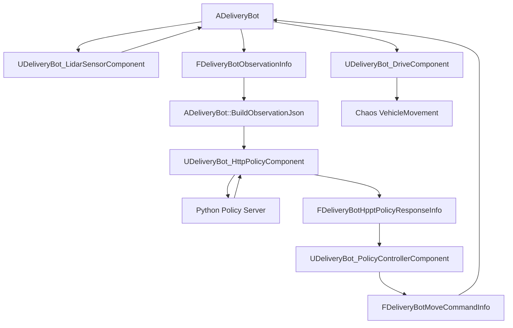
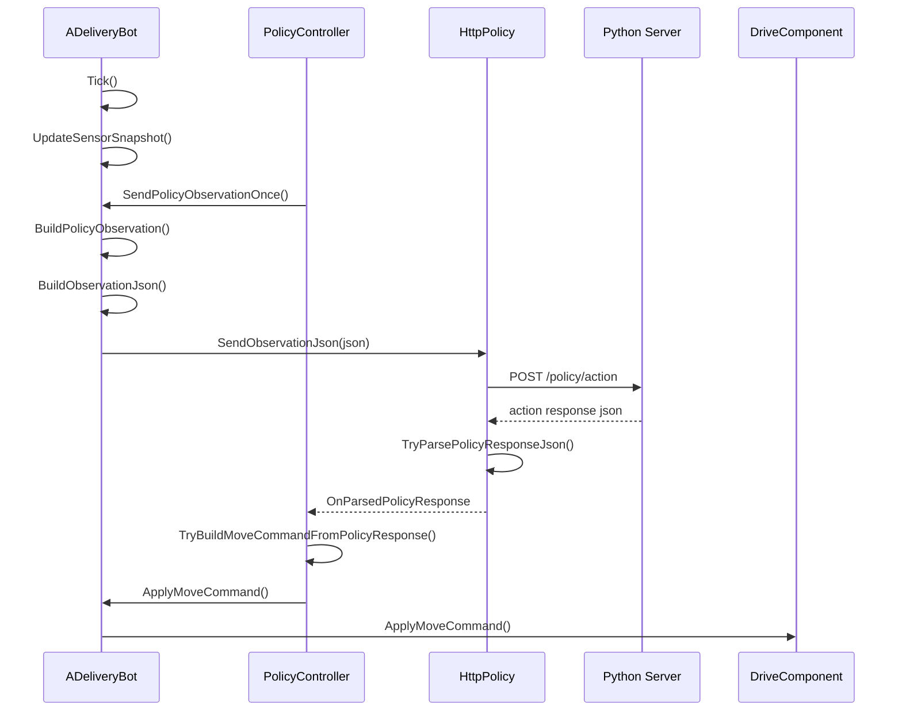

# Python 통신 DeliveryBot 정리

## 기준

이 문서는 `ADeliveryBot` 기반 Python 정책 통신 구조를 기준으로 정리한다.

Unreal은 로봇 물리, 센서 갱신, observation 생성, action 검증과 실행을 담당한다. Python 서버는 observation JSON을 받아 policy action JSON을 반환한다.



## 클래스 위치와 역할

| 클래스/구조체 | 위치 | 역할 |
| --- | --- | --- |
| `ADeliveryBot` | `Source/ProtoRobotSim/Public/DeliveryBot/Actor/DeliveryBot.h` / `Private/DeliveryBot/Actor/DeliveryBot.cpp` | Python 통신형 DeliveryBot의 중심 Actor다. 센서 snapshot을 갱신하고, observation을 만들고, Python action을 최종 이동 명령으로 적용한다. |
| `FDeliveryBotSensorSnapshot` | `DeliveryBot.h` | 한 Tick에서 갱신한 라이다 스캔, 감지 객체 목록, 전방 객체 정보를 묶어 보관한다. |
| `UDeliveryBot_HttpPolicyComponent` | `Source/ProtoRobotSim/Public/DeliveryBot/Component/DeliveryBot_HttpPolicyComponent.h` / `Private/DeliveryBot/Component/DeliveryBot_HttpPolicyComponent.cpp` | observation JSON을 Python 서버로 POST하고, 응답 JSON을 파싱해 delegate로 전달한다. |
| `UDeliveryBot_PolicyControllerComponent` | `Source/ProtoRobotSim/Public/DeliveryBot/Component/DeliveryBot_PolicyControllerComponent.h` / `Private/DeliveryBot/Component/DeliveryBot_PolicyControllerComponent.cpp` | 일정 주기로 Python policy 요청을 보내고, 응답 action을 검증해 `FDeliveryBotMoveCommandInfo`로 변환한다. |
| `UDeliveryBot_DriveComponent` | `Source/ProtoRobotSim/Public/DeliveryBot/Component/DeliveryBot_DriveComponent.h` / `Private/DeliveryBot/Component/DeliveryBot_DriveComponent.cpp` | 검증된 이동 명령을 Chaos Vehicle의 throttle, brake, steering, gear 입력으로 적용한다. |
| `UDeliveryBot_LidarSensorComponent` | `Source/ProtoRobotSim/Public/DeliveryBot/Component/DeliveryBot_LidarSensorComponent.h` / `Private/DeliveryBot/Component/DeliveryBot_LidarSensorComponent.cpp` | 라이다 ray를 쏘고 감지 객체를 만든다. Python observation의 센서 입력원이 된다. |
| `FDeliveryBotObservationInfo` | `Source/ProtoRobotSim/Public/Shared/Struct/DeliveryBot/Observation/DeliveryBotObservationInfo.h` | Python으로 보내는 observation의 C++ 데이터 모델이다. 로봇 상태, 라이다, 감지 객체, 차량 스펙을 포함한다. |
| `FDeliveryBotHpptPolicyResponseInfo` | `Source/ProtoRobotSim/Public/Shared/Struct/DeliveryBot/Policy/DeliveryBotHpptPolicyResponseInfo.h` | Python 응답 JSON을 Unreal에서 쓰기 좋게 파싱한 데이터 모델이다. 현재 파일명/타입명은 `Hppt` 오타가 포함된 상태다. |
| `FDeliveryBotMoveCommandInfo` | `Source/ProtoRobotSim/Public/Shared/Struct/DeliveryBot/Drive/DeliveryBotMovementInfo.h` | 최종 이동 명령이다. 목표 속도, 조향, 브레이크, 전진/후진 방향을 담는다. |

## 실행 흐름



## ADeliveryBot 함수 흐름

| 함수 | 역할 |
| --- | --- |
| `ADeliveryBot()` | `DriveComponent`, `LidarSensorComponent`, `HttpPolicyComponent`, `PolicyControllerComponent`를 생성한다. |
| `BeginPlay()` | setup을 적용하고 첫 sensor snapshot을 만든 뒤 `PolicyControllerComponent`를 초기화한다. |
| `Tick()` | 매 프레임 sensor snapshot을 갱신하고 policy controller tick을 실행한다. |
| `EndPlay()` | policy loop를 중지하고 부모 종료 처리를 호출한다. |
| `InitializeSetupInfo()` | 외부에서 전달된 `FDeliveryBotSetupInfo`를 저장하고 차량/라이다 설정에 적용한다. |
| `ApplySetupInfo()` | Drive 설정과 Lidar 설정을 각 컴포넌트에 전달한다. |
| `UpdateSensorSnapshot()` | 라이다를 스캔하고 감지 객체 목록과 가장 가까운 전방 객체 정보를 갱신한다. |
| `BuildPolicyObservation()` | Python 요청용 observation을 만들고 policy sequence를 증가시킨다. |
| `BuildObservation()` | 디버깅/read-only 용 observation을 만든다. policy sequence는 증가시키지 않는다. |
| `FillObservation()` | 로봇 위치, yaw, 속도, 차량 스펙, 라이다 scan, 감지 객체를 observation에 채운다. |
| `BuildObservedObjectsForPolicy()` | 내부 감지 객체 정보를 Python 전송용 객체 정보로 변환한다. |
| `BuildObservationJson()` | `FDeliveryBotObservationInfo`를 Python 서버로 보낼 JSON 문자열로 직렬화한다. |
| `SendPolicyObservationOnce()` | 현재 observation JSON을 만들고 HTTP component로 한 번 전송한다. 이전 요청이 진행 중이면 보내지 않는다. |
| `ApplyMoveCommand()` | policy controller가 만든 이동 명령을 DriveComponent에 넘겨 실제 차량 입력으로 적용한다. |
| `GetSensorSnapshot()` | 최근 sensor snapshot을 외부에서 읽을 수 있게 반환한다. |
| `DebugLogObservation()` | observation 요약과 JSON 길이를 로그로 출력한다. 현재 Tick에서 직접 호출되지는 않는다. |

## HttpPolicyComponent 함수 흐름

| 함수 | 역할 |
| --- | --- |
| `UDeliveryBot_HttpPolicyComponent()` | HTTP component의 Tick을 끈다. |
| `BeginPlay()` | 종료 상태 플래그를 초기화한다. |
| `EndPlay()` | 진행 중인 HTTP 요청을 취소하고 delegate를 정리한다. |
| `SendObservationJson()` | observation JSON을 Python 서버로 POST한다. 비어 있는 JSON, 종료 중 상태, 기존 요청 진행 중 상태는 거부한다. |
| `TryParsePolicyResponseJson()` | Python 응답 JSON에서 `sequence`, `status`, `action`, `debug`를 파싱한다. |
| `IsRequestInFlight()` | 현재 HTTP 요청이 진행 중인지 반환한다. |
| `CancelActiveRequest()` | active HTTP 요청 callback을 해제하고 요청을 취소한다. |

## PolicyControllerComponent 함수 흐름

| 함수 | 역할 |
| --- | --- |
| `UDeliveryBot_PolicyControllerComponent()` | policy controller의 Tick을 끈다. 실제 반복 요청은 timer로 처리한다. |
| `InitializePolicyController()` | owner DeliveryBot과 HttpPolicyComponent를 저장하고 응답 delegate를 연결한다. 자동 시작이 켜져 있으면 policy loop를 시작한다. |
| `StartPolicyLoop()` | `PolicyRequestIntervalSecond` 간격으로 Python 요청 timer를 시작한다. 최소 간격은 0.05초다. |
| `StopPolicyLoop()` | Python 요청 timer를 중지한다. |
| `EndPlay()` | policy loop를 중지하고 HttpPolicy delegate 연결을 해제한다. |
| `RequestPolicyByTimer()` | owner DeliveryBot에게 observation 전송을 요청한다. |
| `TickPolicy()` | 가장 최근의 유효한 Python action을 매 프레임 적용한다. action이 `PolicyActionTimeoutSecond`보다 오래되면 정지 명령을 적용한다. |
| `HandleParsedPolicyResponse()` | Python 응답을 받고 sequence, stale 여부, 파싱 오류, action 유효성을 검사한다. |
| `TryBuildMoveCommandFromPolicyResponse()` | Python action을 `FDeliveryBotMoveCommandInfo`로 변환하고 steering/throttle/brake/speed/direction 범위를 검증한다. |
| `TryGetMoveDirectionTypeFromPolicyDirection()` | `"Forward"` / `"Reverse"` 문자열을 `EDeliveryBotMoveDirectionType`으로 변환한다. |
| `HandlePolicyFailure()` | 실패 횟수를 누적하고 한계치를 넘으면 policy loop를 멈추고 정지 명령을 적용한다. |
| `BuildStopMoveCommand()` | 정책 실패나 timeout 때 사용할 안전 정지 명령을 만든다. |
| `LogPolicyResponseReceived()` | Python 응답 수신 로그를 남긴다. |
| `LogStalePolicyResponse()` | 이미 더 최신 sequence가 처리된 뒤 늦게 온 응답을 기록한다. |
| `LogValidPolicyAction()` | 검증을 통과한 action 값을 로그로 남긴다. |

## Python 요청 JSON

`ADeliveryBot::BuildObservationJson()`이 만드는 주요 필드는 다음과 같다.

| JSON 필드 | 의미 |
| --- | --- |
| `sequence` | policy observation 순번이다. Python 응답의 `sequence`와 맞춰 stale 응답을 거른다. |
| `sensorSequence` | 센서 snapshot 갱신 순번이다. |
| `worldTimeSeconds` | Unreal World 시간이다. |
| `robotState.x/y/z` | 로봇 위치(cm)다. |
| `robotState.yawDegree` | 로봇 yaw 각도다. |
| `robotState.speedKmh` | 현재 속도(km/h)다. |
| `vehicleSpec.maxSpeedKmh` | 전진 최대 속도다. |
| `vehicleSpec.maxReverseSpeedKmh` | 후진 최대 속도다. |
| `vehicleSpec.lidarScanRangeM` | 라이다 스캔 거리다. |
| `observedObjects[]` | 감지 객체 요약 정보다. |
| `lidarRays[]` | 각 라이다 ray의 hit 여부, yaw, 거리, actor 이름이다. |

예상 요청 형태:

```json
{
  "sequence": 1,
  "sensorSequence": 10,
  "worldTimeSeconds": 3.5,
  "robotState": {
    "x": 120.0,
    "y": 40.0,
    "z": 0.0,
    "yawDegree": 90.0,
    "speedKmh": 4.2
  },
  "vehicleSpec": {
    "maxSpeedKmh": 10.0,
    "maxReverseSpeedKmh": 3.0,
    "lidarScanRangeM": 8.0
  },
  "observedObjects": [],
  "lidarRays": []
}
```

## Python 응답 JSON

`UDeliveryBot_HttpPolicyComponent::TryParsePolicyResponseJson()`은 다음 형태를 기대한다.

```json
{
  "sequence": 1,
  "status": "ok",
  "action": {
    "steering": 0.15,
    "throttle": 0.0,
    "brake": 0.0,
    "targetSpeedKmh": 5.0,
    "direction": "Forward"
  },
  "debug": {
    "policyName": "sample_policy",
    "reason": "clear path"
  }
}
```

| 응답 필드 | Unreal 처리 |
| --- | --- |
| `sequence` | `LastHandledPolicyResponseSequence`보다 작거나 같으면 stale 응답으로 무시한다. |
| `status` | `"ok"`가 아니면 실패로 처리한다. |
| `action.steering` | `-1.0~1.0` 범위를 벗어나면 실패다. |
| `action.throttle` | 현재는 범위 검증만 한다. 실제 주행은 `targetSpeedKmh` 기반 DriveComponent가 throttle을 계산한다. |
| `action.brake` | `0.0~1.0` 범위를 벗어나면 실패다. 0보다 크면 `bBrake=true`가 된다. |
| `action.targetSpeedKmh` | 음수거나 차량 최대 속도를 넘으면 실패다. |
| `action.direction` | `"Forward"` 또는 `"Reverse"`만 허용한다. |
| `debug.policyName` | 로그용 정책 이름이다. |
| `debug.reason` | 로그용 판단 이유다. |

## 실패 처리 흐름

| 실패 상황 | 처리 |
| --- | --- |
| observation JSON이 비어 있음 | 전송하지 않고 false 반환 |
| 기존 HTTP 요청 진행 중 | 새 요청을 보내지 않음 |
| Python 서버 연결 실패 | response info에 error를 채우고 controller에서 실패 카운트 증가 |
| HTTP 200번대가 아님 | error로 처리 |
| JSON 파싱 실패 | error로 처리 |
| `status != "ok"` | error로 처리 |
| `action` 없음 | error로 처리 |
| action 값 범위 오류 | error로 처리 |
| stale sequence | 로그만 남기고 무시 |
| 연속 실패 횟수 초과 | policy loop 중지 후 정지 명령 적용 |
| action timeout | 최근 action 폐기 후 정지 명령 적용 |

## 현재 구조에서 주의할 점

- `FDeliveryBotHpptPolicyResponseInfo` 이름에 `Hppt` 오타가 있다. 코드 호환 때문에 바로 바꾸기보다는 별도 정리 작업으로 분리하는 것이 좋다.
- Python이 보내는 `throttle`은 현재 직접 적용되지 않는다. Unreal DriveComponent는 `targetSpeedKmh`와 현재 속도 차이로 throttle을 계산한다.
- policy loop는 timer로 요청을 보내고, 실제 action 적용은 `TickPolicy()`에서 최신 유효 action을 반복 적용하는 구조다.
- Python 응답이 늦게 오더라도 `sequence`로 stale 응답을 무시한다.
- 실패 시 Unreal이 action을 조용히 보정하지 않고 실패 카운트와 정지 명령으로 처리한다.

## 구현 확장 방향

| 확장 작업 | 위치 | 이유 |
| --- | --- | --- |
| `Hppt` 오타 정리 | `DeliveryBotHpptPolicyResponseInfo.h`, 관련 include/type 사용처 | 장기 유지보수성 향상 |
| Python response schema version 추가 | `TryParsePolicyResponseJson()` | Python/Unreal 계약 변경 추적 |
| 실패 정보를 Episode 결과로 연결 | `PolicyControllerComponent` 또는 Episode 평가 계층 | batch simulation에서 실패 원인 분석 |
| raw lidar 전송 옵션 분리 | `BuildObservationJson()` | 1D/2D/3D 라이다 확장 시 payload 크기 제어 |
| Python action에 `requestControl` 계열 명령 추가 | `TryBuildMoveCommandFromPolicyResponse()` | 경로 재생성, 일시정지, 종료 같은 고수준 정책 확장 |

