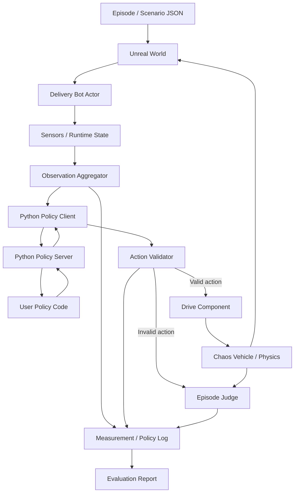
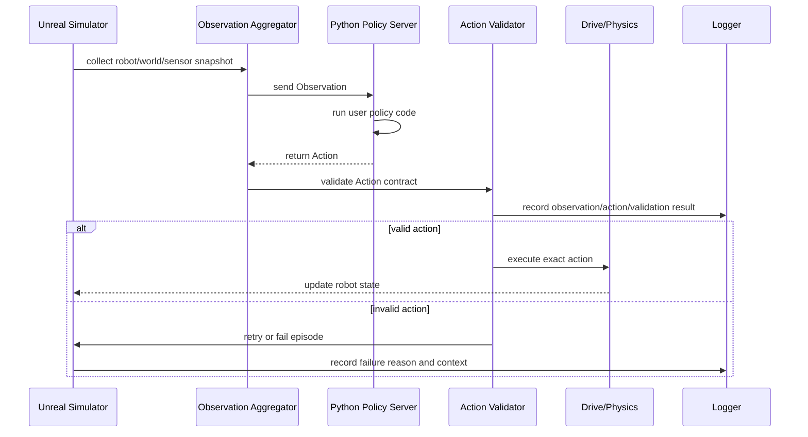
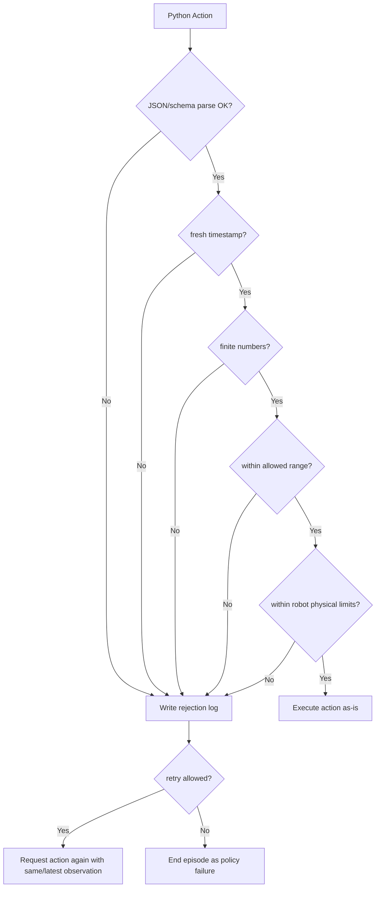
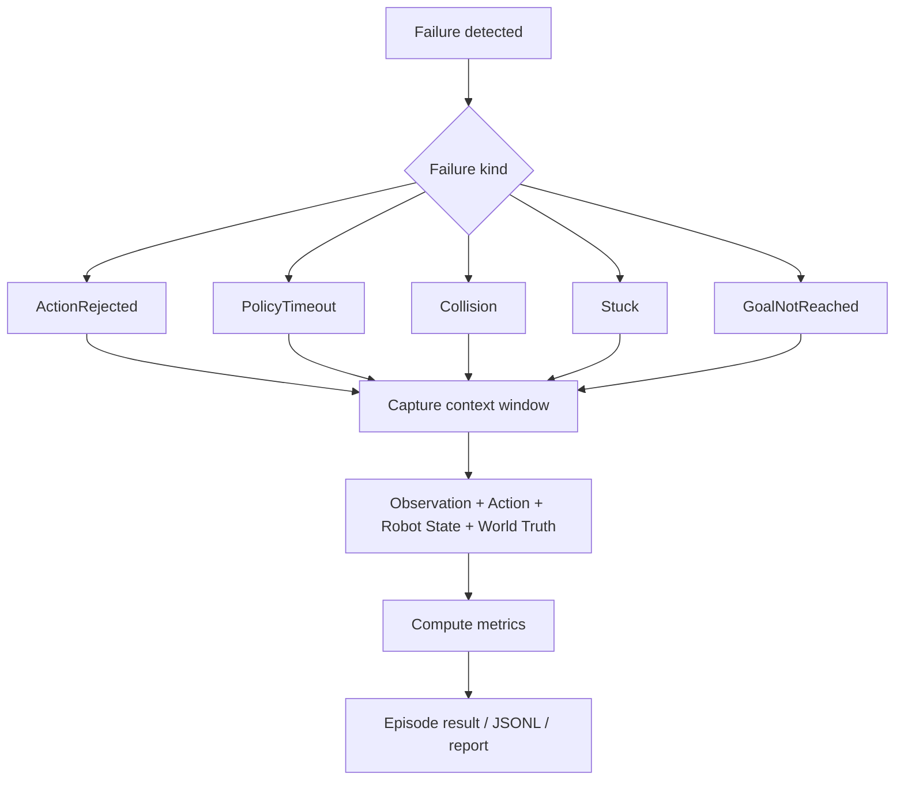
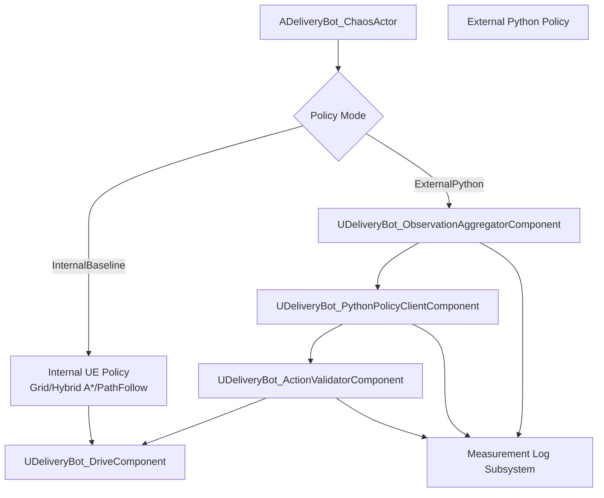

# External Python Policy Simulator 계획

## 프로젝트 소개서

이 프로젝트는 Unreal Engine 기반의 배송 로봇 시뮬레이터이다.

기존 방향이 Unreal 내부에서 경로 탐색과 주행 판단을 모두 처리하는 로봇 데모에 가까웠다면, 새 방향은 외부 사용자가 Python으로 직접 경로 탐색과 주행 정책을 작성하고 검증할 수 있는 실험 플랫폼에 가깝다.

핵심 정체성은 다음과 같다.

```text
Unreal 기반 로봇 물리 실행기
+ Python 기반 교체형 AI/pathfinding policy
+ episode 단위 평가/로그/실패 분석 시스템
```

Unreal은 더 좋은 길을 대신 찾지 않는다. Unreal은 Python policy가 낸 명령을 검증 가능한 계약에 따라 실행하고, 말이 되지 않는 명령이나 실패 상황을 정확히 판정하고 기록한다.

따라서 이 시뮬레이터의 목표는 "로봇이 항상 잘 도착하게 만들기"가 아니라, "사용자가 만든 AI policy가 어떤 상황에서 성공하고 실패하는지 신뢰할 수 있게 드러내기"이다.

## 대상 사용자

| 사용자 | 원하는 것 | 이 프로젝트가 제공해야 하는 것 |
| --- | --- | --- |
| 로보틱스 알고리즘 개발자 | A*, Hybrid A*, RRT, MPC, DWA, RL policy 비교 | 같은 episode에서 policy 교체 실행, 결과 비교, 실패 로그 |
| AI/ML 연구자 | observation을 받아 action을 내는 모델 평가 | 안정적인 Observation/Action API, batch evaluation, replay |
| 교육/실습 사용자 | Python으로 경로 탐색을 구현하고 바로 확인 | 간단한 샘플 policy, 명확한 실패 사유, 시각화 |
| 물류/배송 로봇 PoC 팀 | 현실 로봇 없이 정책 위험성 검토 | 시나리오 JSON, 이벤트, metric, collision/timeout 분석 |

이 프로젝트의 주 사용자는 Unreal C++ 내부를 수정하려는 사람이 아니라, Python에서 로봇의 판단 로직을 바꾸고 싶은 사람이다.

## 핵심 원칙

1. Unreal은 simulation authority이다.
2. Python은 policy authority이다.
3. Unreal은 Python 대신 길찾기를 하지 않는다.
4. Python action이 유효하면 Unreal은 그대로 실행한다.
5. Python action이 계약을 위반하면 Unreal은 보정하지 않고 실패 또는 재요청으로 처리한다.
6. 실패는 숨기지 않고 episode 결과와 로그로 남긴다.
7. LLM은 runtime 운전자가 아니라 Python policy 코드 작성을 돕는 개발 도구로 본다.

## 비목표

- Python 실패 시 Unreal 내부 pathfinding으로 자동 fallback
- Python action을 조용히 clamp해서 성공처럼 보이게 만들기
- 매 frame LLM 호출로 실시간 주행 판단
- Unreal 내부 알고리즘 성능을 최종 제품 가치로 삼기
- 모든 raw sensor data를 무제한 전송
- 처음부터 완전한 deterministic replay 보장

## 전체 프로젝트 흐름도



## Runtime 데이터 흐름



## Action 검증 흐름도



## 실패 분석 흐름도



## 권한 분리

| 영역 | Unreal | Python |
| --- | --- | --- |
| 월드 생성 | 소유 | 사용 안 함 |
| 물리/충돌 | 소유 | 직접 제어 안 함 |
| 센서 생성 | 소유 | Observation으로 소비 |
| Observation 정규화 | 소유 | 계약에 맞춰 수신 |
| 길찾기 판단 | 하지 않음 | 소유 |
| 조향/속도/브레이크 판단 | 하지 않음 | 소유 |
| action schema 검증 | 소유 | 계약 준수 |
| action 실행 | 소유 | 직접 실행 안 함 |
| 실패 판정 | 소유 | 원인 제공 가능 |
| 로그/리포트 | 소유 | debug info 제공 |

중요한 기준은 "판단"과 "검증"을 분리하는 것이다.

Python은 어디로 갈지, 얼마나 돌릴지, 얼마나 밟을지 판단한다. Unreal은 그 명령이 시뮬레이터 계약과 로봇 물리 한계를 넘는지 확인하고 실행한다.

## Observation 계약 초안

Observation은 Python policy가 판단에 사용할 수 있는 데이터이다.

```json
{
  "version": 1,
  "episodeId": "episode_001",
  "robotId": "robot_01",
  "sequence": 120,
  "worldTimeSeconds": 12.345,
  "deltaSeconds": 0.0167,
  "robot": {
    "positionCm": [0.0, 0.0, 0.0],
    "rotationYawDeg": 90.0,
    "linearVelocityCmPerSec": [0.0, 120.0, 0.0],
    "speedKmh": 4.32,
    "gear": "Forward"
  },
  "goal": {
    "positionCm": [1000.0, 500.0, 0.0],
    "acceptanceRadiusCm": 100.0
  },
  "sensors": {
    "lidar2d": {
      "angleMinDeg": -180.0,
      "angleMaxDeg": 180.0,
      "rangesM": [1.2, 1.4, 2.0]
    }
  },
  "localMap": {
    "frame": "robot",
    "cellSizeCm": 50.0,
    "width": 40,
    "height": 40,
    "occupancy": []
  },
  "constraints": {
    "maxForwardSpeedKmh": 8.0,
    "maxReverseSpeedKmh": 3.0,
    "maxSteering": 1.0,
    "minActionIntervalSeconds": 0.05
  }
}
```

규칙:
- Python에 넘기는 값은 policy 입력으로 허용된 값이어야 한다.
- 사후 분석용 truth와 policy observation은 구분한다.
- 필드 추가는 optional로 한다.
- 호환 불가 변경은 `version`을 올린다.
- 단위는 명시한다. 위치는 cm, 속도는 km/h 또는 cm/s를 명확히 구분한다.

## Action 계약 초안

Action은 Python policy가 Unreal에 실행을 요청하는 명령이다.

```json
{
  "version": 1,
  "episodeId": "episode_001",
  "robotId": "robot_01",
  "sequence": 120,
  "mode": "DirectControl",
  "action": {
    "steering": 0.15,
    "targetSpeedKmh": 3.0,
    "throttle": 0.4,
    "brake": 0.0,
    "direction": "Forward"
  },
  "validForSeconds": 0.1,
  "debug": {
    "policyName": "sample_hybrid_astar",
    "reason": "follow_local_waypoint"
  }
}
```

기본 모드는 `DirectControl`로 둔다.

다만 실험 편의를 위해 나중에 아래 모드를 선택적으로 추가할 수 있다.

| mode | 의미 | Unreal 역할 |
| --- | --- | --- |
| `DirectControl` | steering/speed/throttle/brake 직접 명령 | 값 검증 후 그대로 실행 |
| `WaypointControl` | 다음 target waypoint 반환 | 저수준 controller만 실행 |
| `Stop` | 명시적 정지 | 브레이크 적용 |

MVP에서는 `DirectControl`을 우선한다. `WaypointControl`은 Unreal이 조향 판단을 일부 하게 되므로, policy 평가 목적에서는 별도 모드로 명확히 구분해야 한다.

## Action Validator 기준

Validator는 좋은 길을 고르는 계층이 아니다. 계약 위반을 판정하는 계층이다.

검증 항목:
- JSON parse 실패
- 필수 필드 누락
- `version` 불일치
- `episodeId`, `robotId`, `sequence` 불일치
- `NaN`, `Infinity`, 문자열 숫자 등 비정상 값
- steering 범위 초과
- target speed 범위 초과
- throttle/brake 범위 초과
- 전진/후진 기어와 속도 제한 불일치
- 지나치게 오래된 action
- timeout
- 같은 observation에 대한 retry 횟수 초과

기본 정책:

| 상황 | 처리 |
| --- | --- |
| 정상 action | 그대로 실행 |
| schema 오류 | action reject |
| 물리 한계 초과 | action reject |
| 통신 timeout | retry 또는 episode fail |
| Python 서버 종료 | episode fail |
| 충돌 | episode fail 또는 event 기록 후 정책에 따라 종료 |
| 목적지 도착 | episode success |

`clamp`는 기본값으로 사용하지 않는다. `steering=999`를 `steering=1`로 바꿔 실행하면 Python policy의 버그를 숨기기 때문이다.

필요하다면 개발 편의용 `LenientDebugMode`에서만 clamp를 허용하고, 결과 report에는 반드시 `actionModified=true`를 남긴다.

## 통신 구조 초안

MVP에서는 HTTP JSON 또는 WebSocket JSON 중 하나를 선택할 수 있다.

| 방식 | 장점 | 단점 |
| --- | --- | --- |
| HTTP request/response | 구현과 디버깅이 쉬움 | 고주파 제어에는 overhead |
| WebSocket | 연결 유지, latency 감소 | 상태 관리 복잡 |
| gRPC | schema와 성능 좋음 | Unreal 연동 부담 |

초기 추천은 HTTP JSON이다.

이유:
- Python sample server 작성이 쉽다.
- 사용자가 curl/Postman으로 테스트할 수 있다.
- Unreal C++ 구현 부담이 비교적 낮다.
- 정책 검증 단계에서는 절대 성능보다 계약 안정성이 더 중요하다.

성능 문제가 확인되면 WebSocket이나 binary protocol로 확장한다.

## Python Policy Server 예시

```python
def decide(observation: dict) -> dict:
    robot = observation["robot"]
    goal = observation["goal"]

    # 사용자 policy가 이 부분을 자유롭게 구현한다.
    steering = 0.0
    target_speed_kmh = 2.0

    return {
        "version": 1,
        "episodeId": observation["episodeId"],
        "robotId": observation["robotId"],
        "sequence": observation["sequence"],
        "mode": "DirectControl",
        "action": {
            "steering": steering,
            "targetSpeedKmh": target_speed_kmh,
            "throttle": 0.3,
            "brake": 0.0,
            "direction": "Forward"
        },
        "validForSeconds": 0.1,
        "debug": {
            "policyName": "sample_policy",
            "reason": "baseline"
        }
    }
```

Python sample은 사용자가 가장 먼저 만지는 진입점이므로 Unreal 내부 구조보다 훨씬 친절해야 한다.

## Unreal 내부 구조 계획

기존 구조는 유지하되, 외부 policy 경로를 명시적으로 추가한다.



제안 컴포넌트:

| 컴포넌트 | 역할 |
| --- | --- |
| `UDeliveryBot_ObservationAggregatorComponent` | 로봇 상태, goal, sensor, local map을 Observation DTO로 생성 |
| `UDeliveryBot_PythonPolicyClientComponent` | Python server로 Observation 전송, Action 수신, timeout 관리 |
| `UDeliveryBot_ActionValidatorComponent` | Action 계약 검증, reject reason 생성 |
| `UDeliveryBot_PolicyExecutionComponent` | policy mode 선택과 retry/fail 흐름 소유 |

기존 컴포넌트 위치:
- `UDeliveryBot_GlobalPathComponent`는 InternalBaseline 용도로 유지한다.
- `UDeliveryBot_PathFollowComponent`는 InternalBaseline 또는 선택적 WaypointControl 용도로 유지한다.
- `UDeliveryBot_DriveComponent`는 외부/내부 policy 공통 실행 계층으로 유지한다.

## 평가 metric

Episode 결과는 성공/실패만으로 부족하다.

필수 metric:
- `success`
- `failureReason`
- `goalReached`
- `elapsedSeconds`
- `distanceTraveledCm`
- `collisionCount`
- `nearMissCount`
- `policyTimeoutCount`
- `actionRejectedCount`
- `maxSpeedKmh`
- `averageSpeedKmh`
- `maxSteeringDelta`
- `brakeCount`
- `reverseDistanceCm`

Action reject reason 예시:

| code | 의미 |
| --- | --- |
| `schema_parse_failed` | JSON 파싱 실패 |
| `missing_required_field` | 필수 필드 누락 |
| `invalid_sequence` | Observation sequence와 불일치 |
| `stale_action` | 너무 오래된 action |
| `non_finite_number` | NaN 또는 Infinity |
| `steering_out_of_range` | steering 범위 초과 |
| `speed_out_of_range` | 속도 범위 초과 |
| `throttle_out_of_range` | throttle 범위 초과 |
| `brake_out_of_range` | brake 범위 초과 |
| `direction_invalid` | direction 값 오류 |
| `physical_limit_exceeded` | 로봇 물리 한계 초과 |
| `policy_timeout` | Python 응답 timeout |

## 로그 계약

기존 measurement logging 방향과 연결한다.

추가로 필요한 record:

```json
{"type":"policy_observation","sequence":120,"worldTimeSeconds":12.345,"robotId":"robot_01","payload":{}}
{"type":"policy_action","sequence":120,"worldTimeSeconds":12.401,"robotId":"robot_01","payload":{}}
{"type":"policy_rejection","sequence":120,"worldTimeSeconds":12.402,"robotId":"robot_01","code":"speed_out_of_range","message":"targetSpeedKmh exceeds maxForwardSpeedKmh","payload":{}}
```

기록 원칙:
- policy observation과 simulation truth를 분리한다.
- Python이 받은 입력을 재현 가능하게 저장한다.
- Python이 보낸 원본 action을 수정 없이 저장한다.
- reject된 action은 실행하지 않는다.
- retry가 발생하면 같은 sequence 또는 새 sequence 규칙을 명확히 둔다.

## 개발 모드

| 모드 | 목적 | 동작 |
| --- | --- | --- |
| `InternalBaseline` | 기존 UE pathfinding 비교 기준 | GlobalPath/PathFollow 사용 |
| `ExternalStrict` | 실제 policy 평가 | Python action 검증, 실패 시 reject/fail |
| `ExternalRetry` | 개발 중 편의 | reject/timeout 시 제한 횟수 재요청 |
| `ExternalLenientDebug` | 초보자 디버깅 | clamp 가능, report에 수정 기록 |

기본 평가 모드는 `ExternalStrict`이다.

## 구현 계획

### Phase 1: 계약과 모드 정의

목표: Unreal/Python 경계를 먼저 고정한다.

작업:
- `ExternalPython` policy mode 정의
- Observation DTO 문서화
- Action DTO 문서화
- Action reject reason enum 정의
- strict/retry/debug mode 정책 정의
- sample JSON fixture 작성

완료 기준:
- Python 없이도 Observation/Action sample을 문서와 fixture로 검증 가능
- Unreal 내부 pathfinding fallback 금지 원칙이 문서와 설정에 반영

### Phase 2: Unreal Observation Aggregator

목표: Python에 넘길 policy input을 생성한다.

작업:
- 로봇 pose, velocity, gear, speed 수집
- goal 정보 수집
- lidar/perception 요약 수집
- local map 또는 grid 요약 수집
- constraints 포함
- sequence/worldTime 포함

완료 기준:
- PIE에서 매 policy step마다 Observation JSON 생성
- Observation과 truth log가 구분됨

### Phase 3: Python Policy Client

목표: Unreal에서 Python server로 Observation을 보내고 Action을 받는다.

작업:
- server URL 설정
- request timeout 설정
- response parse
- connection failure 처리
- latest request/response logging
- sample Python server 제공

완료 기준:
- sample server가 steering/speed action을 반환
- Python server 종료 시 episode failure 또는 retry로 처리

### Phase 4: Action Validator

목표: Python action을 보정하지 않고 검증한다.

작업:
- schema 검증
- sequence 검증
- finite number 검증
- range 검증
- robot physical limit 검증
- reject result 구조화
- retry/fail 분기

완료 기준:
- `targetSpeedKmh=100` 입력 시 action reject 기록
- `steering=999`, `NaN`, missing field fixture가 모두 실패 사유를 남김
- valid action은 수정 없이 DriveComponent로 전달

### Phase 5: Drive 실행 연결

목표: 유효한 Python action을 실제 로봇에 적용한다.

작업:
- `FDeliveryBotMoveCommandInfo` 또는 별도 direct action DTO로 변환
- steering/throttle/brake/target speed/direction 적용
- 기존 DriveComponent 제한과 중복 검증 정리
- 내부 policy와 외부 policy 실행 경로 분리

완료 기준:
- ExternalStrict에서 Unreal pathfinding 없이 Python action만으로 이동
- InternalBaseline과 ExternalPython 결과를 비교 가능

### Phase 6: 실패 판정과 리포트

목표: 어디서 왜 실패했는지 사용자가 알 수 있게 한다.

작업:
- action reject event 기록
- policy timeout event 기록
- collision/stuck/goal fail event 기록
- context window 저장
- episode summary report 생성
- policy별 metric 비교

완료 기준:
- 실패 episode에서 마지막 observation, 원본 action, reject reason 확인 가능
- 여러 policy 결과를 같은 기준으로 비교 가능

### Phase 7: 사용자용 SDK와 샘플

목표: 사용자가 Unreal을 몰라도 Python policy를 작성할 수 있게 한다.

작업:
- `python_policy_server` 샘플 폴더
- baseline direct-control policy
- simple waypoint policy
- invalid action 테스트 policy
- README/tutorial
- JSON schema 파일

완료 기준:
- 사용자가 sample server를 실행하고 PIE에서 로봇을 움직일 수 있음
- policy 버그가 발생했을 때 report에서 원인을 찾을 수 있음

## 작업 목록

- [ ] External policy mode 이름과 설정 위치 결정
- [ ] Observation JSON schema 초안 작성
- [ ] Action JSON schema 초안 작성
- [ ] Reject reason enum 설계
- [ ] Observation Aggregator 컴포넌트 설계
- [ ] Python Policy Client 컴포넌트 설계
- [ ] Action Validator 컴포넌트 설계
- [ ] sample Python policy server 작성
- [ ] Unreal에서 Python server timeout 처리
- [ ] valid action을 DriveComponent에 연결
- [ ] invalid action fixture 테스트
- [ ] policy observation/action/rejection 로그 추가
- [ ] episode failure report에 policy failure 포함
- [ ] InternalBaseline과 ExternalStrict 비교 실행 문서화

## 사용자 경험 흐름

```text
1. 사용자가 Python policy server를 실행한다.
2. Unreal에서 episode JSON을 선택한다.
3. Delivery Bot policy mode를 ExternalStrict로 설정한다.
4. PIE를 시작한다.
5. Unreal이 Observation을 Python으로 보낸다.
6. Python이 Action을 반환한다.
7. Unreal이 Action을 검증한다.
8. 정상 action이면 그대로 실행한다.
9. 이상 action이면 reject/retry/fail로 처리한다.
10. episode 종료 후 report에서 성공/실패와 원인을 확인한다.
```

## 개발자 관점 평가

이 방향은 실제 policy 개발자에게 설득력이 있다.

좋은 점:
- Unreal이 몰래 도와주지 않으므로 policy 성능을 믿을 수 있다.
- 실패도 중요한 결과로 저장되므로 디버깅이 쉽다.
- Python 중심이라 알고리즘 교체 비용이 낮다.
- 같은 episode에서 여러 policy를 비교할 수 있다.
- 향후 RL, MPC, classical planner, LLM-generated code 실험으로 확장 가능하다.

주의할 점:
- 통신 latency가 제어 품질을 흔들 수 있다.
- Observation이 너무 크면 Python 개발자가 다루기 어렵다.
- Action 계약이 불명확하면 실패 원인이 Unreal인지 Python인지 헷갈린다.
- Unreal 내부 safety check가 너무 강하면 policy 판단을 침범할 수 있다.
- Unreal 내부 safety check가 너무 약하면 말도 안 되는 action이 물리 시뮬레이션을 망가뜨릴 수 있다.

따라서 초반에는 기능을 많이 넣기보다 계약을 엄격히 만드는 것이 중요하다.

## 최종 방향 요약

프로젝트는 다음 방향으로 정리한다.

```text
Delivery Bot Simulator
-> Unreal internal pathfinding demo
-> External Python policy evaluation simulator
-> Policy debugging / comparison / failure analysis platform
```

Unreal은 길을 찾는 두뇌가 아니라, 세계를 만들고 물리를 실행하며 실패를 판정하는 심판이다.

Python은 로봇이 어떻게 움직일지 결정하는 두뇌이다.

이 분리가 명확할수록 이 시뮬레이터는 다른 사용자가 자기 알고리즘을 꽂아 넣고 믿고 평가할 수 있는 플랫폼이 된다.
