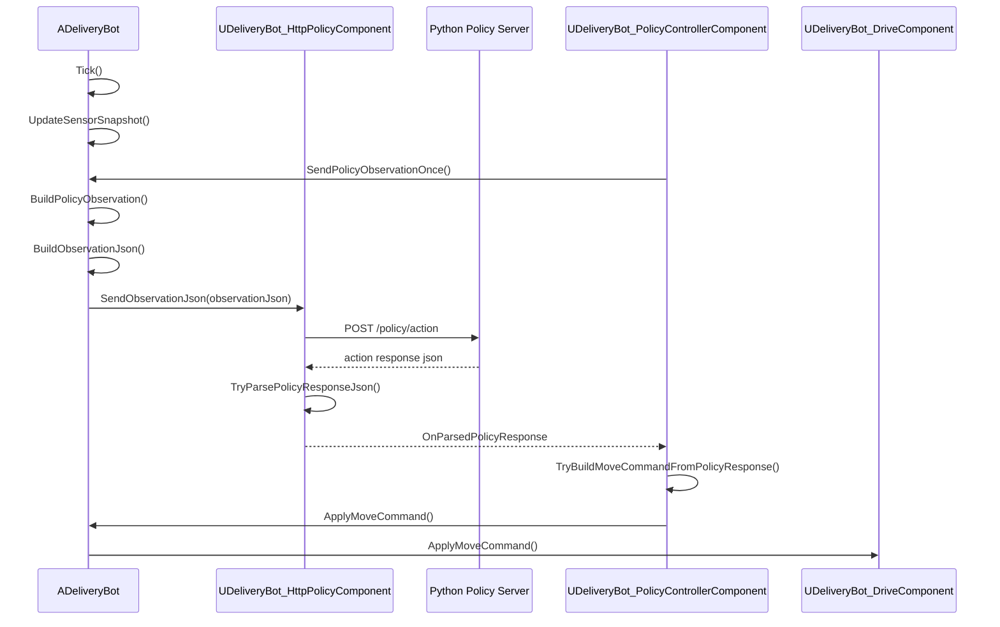

# Python JSON 형식 정리

이 문서는 `ADeliveryBot` 클래스를 기준으로 정리한다. 기준 통신 흐름은 아래 클래스들이다.

- `ADeliveryBot`
- `UDeliveryBot_HttpPolicyComponent`
- `UDeliveryBot_PolicyControllerComponent`
- `UDeliveryBot_DriveComponent`
- `UDeliveryBot_LidarSensorComponent`

## 전체 통신 흐름



## 사용하는 HTTP Endpoint

`UDeliveryBot_HttpPolicyComponent` 기준 기본 설정이다.

| 항목 | 값 |
| --- | --- |
| Method | `POST` |
| URL | `http://127.0.0.1:8000/policy/action` |
| Header | `Content-Type: application/json` |
| Timeout | `2.0초` |

## Unreal -> Python 요청 JSON

생성 함수:

```cpp
ADeliveryBot::BuildObservationJson()
```

전송 함수:

```cpp
ADeliveryBot::SendPolicyObservationOnce()
UDeliveryBot_HttpPolicyComponent::SendObservationJson()
```

요청 JSON 형식:

```json
{
  "sequence": 1,
  "sensorSequence": 10,
  "worldTimeSeconds": 3.5,
  "robotState": {
    "x": 120.0,
    "y": 40.0,
    "z": 0.0,
    "yawDegree": 90.0,
    "speedKmh": 4.2
  },
  "vehicleSpec": {
    "maxSpeedKmh": 10.0,
    "maxReverseSpeedKmh": 3.0,
    "lidarScanRangeM": 8.0
  },
  "observedObjects": [
    {
      "actorName": "Obstacle_01",
      "closestDistanceM": 2.4,
      "closestRayYawDegree": -6.0,
      "totalHitRayCount": 5,
      "frontHitRayCount": 3,
      "inFront": true
    }
  ],
  "lidarRays": [
    {
      "hit": true,
      "rayIndex": 0,
      "rayYawDegree": -20.0,
      "distanceM": 2.7,
      "actorName": "Obstacle_01"
    }
  ]
}
```

## 요청 필드 설명

| 필드 | 타입 | 설명 |
| --- | --- | --- |
| `sequence` | number | Python policy 요청 순번이다. Python 응답의 `sequence`와 비교해 오래된 응답을 무시한다. |
| `sensorSequence` | number | 라이다 sensor snapshot 갱신 순번이다. |
| `worldTimeSeconds` | number | Unreal World 시간(초)이다. |
| `robotState` | object | 현재 로봇 상태다. |
| `robotState.x` | number | 로봇 X 위치(cm)다. |
| `robotState.y` | number | 로봇 Y 위치(cm)다. |
| `robotState.z` | number | 로봇 Z 위치(cm)다. |
| `robotState.yawDegree` | number | 로봇 yaw 각도(degree)다. |
| `robotState.speedKmh` | number | 로봇 현재 속도(km/h)다. |
| `vehicleSpec` | object | Python이 action 한계를 판단하기 위한 차량 스펙이다. |
| `vehicleSpec.maxSpeedKmh` | number | 전진 최대 속도(km/h)다. |
| `vehicleSpec.maxReverseSpeedKmh` | number | 후진 최대 속도(km/h)다. |
| `vehicleSpec.lidarScanRangeM` | number | 라이다 최대 스캔 거리(m)다. |
| `observedObjects` | array | 라이다에 감지된 actor 단위 요약 정보다. |
| `observedObjects[].actorName` | string | 감지된 actor 이름이다. |
| `observedObjects[].closestDistanceM` | number | 해당 actor와 가장 가까운 hit 거리(m)다. |
| `observedObjects[].closestRayYawDegree` | number | 가장 가까운 hit ray의 yaw(degree)다. |
| `observedObjects[].totalHitRayCount` | number | 해당 actor에 맞은 전체 ray 수다. |
| `observedObjects[].frontHitRayCount` | number | 전방 영역에서 해당 actor에 맞은 ray 수다. |
| `observedObjects[].inFront` | boolean | 전방 장애물로 볼 수 있는지 여부다. |
| `lidarRays` | array | 개별 라이다 ray 정보다. |
| `lidarRays[].hit` | boolean | ray가 actor에 맞았는지 여부다. |
| `lidarRays[].rayIndex` | number | ray 인덱스다. |
| `lidarRays[].rayYawDegree` | number | ray yaw(degree)다. |
| `lidarRays[].distanceM` | number | hit 거리 또는 miss 거리(m)다. |
| `lidarRays[].actorName` | string | hit actor 이름이다. miss면 빈 문자열일 수 있다. |

## 현재 C++ 구조체에는 있지만 JSON으로 보내지 않는 값

아래 값들은 C++ 구조체에는 있지만 현재 `ADeliveryBot::BuildObservationJson()`에서 Python으로 보내지 않는다.

| C++ 데이터 | 현재 JSON 포함 여부 |
| --- | --- |
| `RobotState.VelocityCmPerSecond` | 미포함 |
| `VehicleSpec.RobotBoxExtentCm` | 미포함 |
| `VehicleSpec.MinTurningRadiusCm` | 미포함 |
| `VehicleSpec.LidarModeType` | 미포함 |
| `LidarScanInfo.SensorLocationCm` | 미포함 |
| `LidarRayInfo.StartLocationCm` | 미포함 |
| `LidarRayInfo.EndLocationCm` | 미포함 |
| `LidarRayInfo.HitLocationCm` | 미포함 |
| `LidarRayInfo.ActorTags` | 미포함 |
| `ObservedObject.ActorTags` | 미포함 |
| `ObservedObject.ClosestHitLocationCm` | 미포함 |

## Python -> Unreal 응답 JSON

파싱 함수:

```cpp
UDeliveryBot_HttpPolicyComponent::TryParsePolicyResponseJson()
```

검증 함수:

```cpp
UDeliveryBot_PolicyControllerComponent::TryBuildMoveCommandFromPolicyResponse()
```

응답 JSON 형식:

```json
{
  "sequence": 1,
  "status": "ok",
  "action": {
    "steering": 0.15,
    "throttle": 0.0,
    "brake": 0.0,
    "targetSpeedKmh": 5.0,
    "direction": "Forward"
  },
  "debug": {
    "policyName": "sample_policy",
    "reason": "clear path"
  }
}
```

## 응답 필드 설명

| 필드 | 타입 | 필수 | 설명 |
| --- | --- | --- | --- |
| `sequence` | number | 필수 | 어떤 observation에 대한 응답인지 나타낸다. `LastHandledPolicyResponseSequence`보다 작거나 같으면 stale 응답으로 무시된다. |
| `status` | string | 필수 | `"ok"`여야 한다. 다른 값이면 실패 처리된다. |
| `action` | object | 필수 | Python이 선택한 주행 action이다. 없으면 실패 처리된다. |
| `action.steering` | number | 필수 | 조향값이다. `-1.0 ~ 1.0` 범위여야 한다. |
| `action.throttle` | number | 필수 | 현재는 범위 검증만 한다. `0.0 ~ 1.0` 범위여야 한다. |
| `action.brake` | number | 필수 | 브레이크값이다. `0.0 ~ 1.0` 범위여야 한다. 0보다 크면 Unreal에서 `bBrake = true`가 된다. |
| `action.targetSpeedKmh` | number | 필수 | 목표 속도(km/h)다. 음수일 수 없고, 차량 최대 속도를 넘으면 실패다. |
| `action.direction` | string | 필수 | `"Forward"` 또는 `"Reverse"`만 허용한다. |
| `debug` | object | 선택 | Python policy 디버깅 정보다. |
| `debug.policyName` | string | 선택 | Python에서 사용한 정책 이름이다. |
| `debug.reason` | string | 선택 | Python이 action을 선택한 이유다. |

## Unreal 응답 검증 규칙

`UDeliveryBot_PolicyControllerComponent`는 Python 응답을 아래 기준으로 검증한다.

| 검증 | 실패 조건 |
| --- | --- |
| sequence 유효성 | `sequence <= 0` |
| stale 응답 | `sequence <= LastHandledPolicyResponseSequence`이면 실패는 아니고 무시 |
| status | `status != "ok"` |
| action 존재 | `action` object 없음 |
| steering | finite가 아니거나 `-1.0 ~ 1.0` 범위 밖 |
| throttle | finite가 아니거나 `0.0 ~ 1.0` 범위 밖 |
| brake | finite가 아니거나 `0.0 ~ 1.0` 범위 밖 |
| targetSpeedKmh | finite가 아니거나 음수 |
| direction | `"Forward"`, `"Reverse"` 외 문자열 |
| 속도 제한 | Forward면 `vehicleSpec.maxSpeedKmh`, Reverse면 `vehicleSpec.maxReverseSpeedKmh` 초과 |

## Unreal 적용 방식

검증을 통과한 Python action은 `FDeliveryBotMoveCommandInfo`로 변환된다.

```cpp
outMoveCommandInfo.TargetSpeedKmh = action.TargetSpeedKmh;
outMoveCommandInfo.Steering = action.Steering;
outMoveCommandInfo.Brake = action.Brake;
outMoveCommandInfo.bBrake = action.Brake > KINDA_SMALL_NUMBER;
outMoveCommandInfo.MoveDirectionType = moveDirectionType;
```

주의할 점:

- `action.throttle`은 현재 직접 적용되지 않는다.
- 실제 throttle은 `UDeliveryBot_DriveComponent`가 `targetSpeedKmh`와 현재 속도를 비교해서 계산한다.
- 가장 최근 유효 action은 `UDeliveryBot_PolicyControllerComponent::TickPolicy()`에서 매 프레임 반복 적용된다.
- action이 `PolicyActionTimeoutSecond`보다 오래되면 정지 명령이 적용된다.
- 연속 실패 횟수가 `MaxConsecutivePolicyFailureCount` 이상이면 policy loop가 멈추고 정지 명령이 적용된다.

## 빠른 Python 서버 예시

```python
from fastapi import FastAPI

app = FastAPI()

@app.post("/policy/action")
async def policy_action(observation: dict):
    sequence = int(observation.get("sequence", 0))
    robot_state = observation.get("robotState", {})
    vehicle_spec = observation.get("vehicleSpec", {})
    observed_objects = observation.get("observedObjects", [])

    max_speed = float(vehicle_spec.get("maxSpeedKmh", 0.0))
    target_speed = min(max_speed, 4.0)

    steering = 0.0
    brake = 0.0
    reason = "clear path"

    front_objects = [obj for obj in observed_objects if obj.get("inFront", False)]
    if front_objects:
        nearest = min(front_objects, key=lambda obj: float(obj.get("closestDistanceM", 999.0)))
        distance = float(nearest.get("closestDistanceM", 999.0))

        if distance < 1.5:
            target_speed = 0.0
            brake = 1.0
            reason = "front object is too close"
        elif distance < 4.0:
            target_speed = min(target_speed, 2.0)
            reason = "slow down near front object"

    return {
        "sequence": sequence,
        "status": "ok",
        "action": {
            "steering": steering,
            "throttle": 0.0,
            "brake": brake,
            "targetSpeedKmh": target_speed,
            "direction": "Forward",
        },
        "debug": {
            "policyName": "deliverybot_sample_policy",
            "reason": reason,
        },
    }
```

## 현재 코드 기준 주의사항

- 이 문서는 `ADeliveryBot` 기준이다.
- Python 서버는 반드시 `/policy/action`에서 action JSON을 반환해야 한다.
- `sequence`는 요청에서 받은 값을 그대로 응답에 넣는 것이 안전하다.
- `direction`은 `"Forward"` 또는 `"Reverse"`만 사용한다.
- `targetSpeedKmh`는 Unreal에서 차량 최대 속도와 비교하므로, Python에서 미리 제한하는 것이 좋다.
- `throttle`은 현재 기록/확장용에 가깝고 실제 차량 입력은 `targetSpeedKmh` 중심으로 처리된다.
